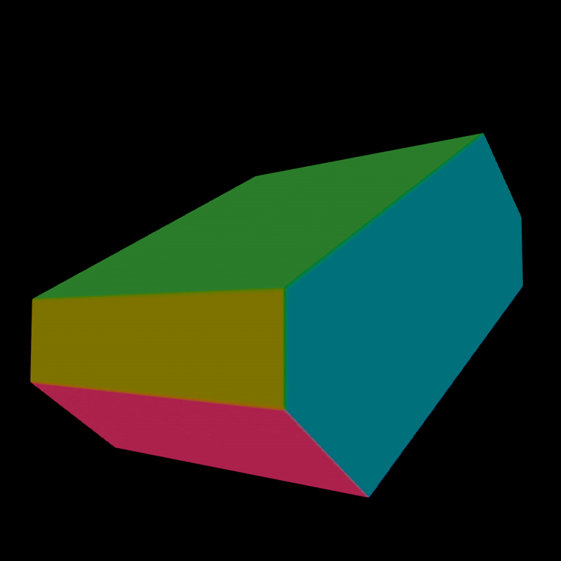
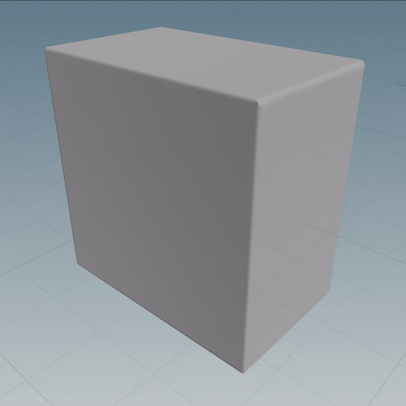
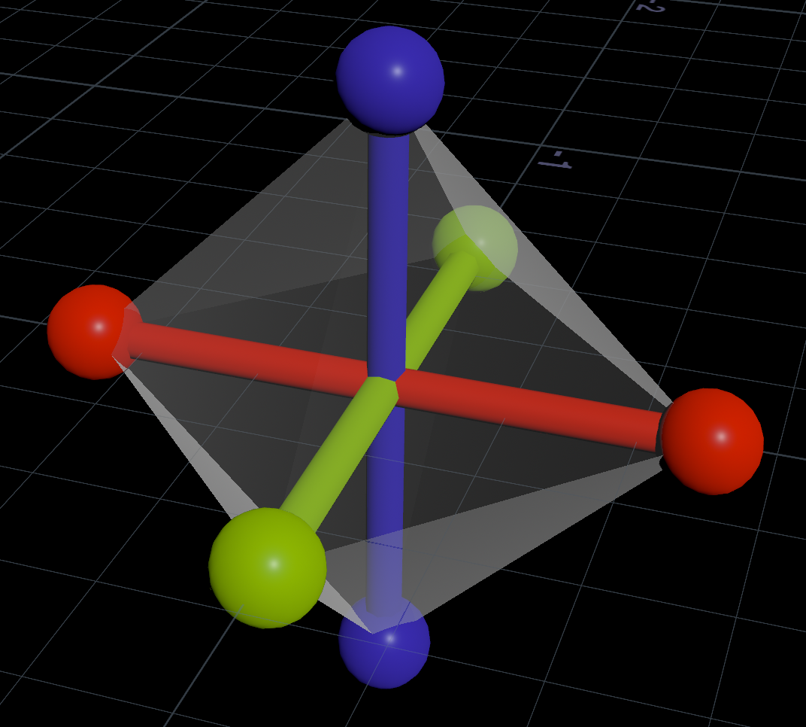

# Houdini 4D Geometry
High dimensional geometry is a really cool topic to research and mess around with.

I wasted a bunch of time looking into it, so I hope you do as well!

<p align="left">
	
	
</p>

## What is 4D?
What does it mean for something to be 4D? It's really just another axis to store numbers along.

- 3D coordinates can be stored as a `vector`, meaning 3 numbers along `(X, Y, Z)` axes.
- 4D coordinates can be stored as a `vector4`, meaning 4 numbers along `(X, Y, Z, W)` axes.

In other words, we just need to add a `W` axis alongside the `X, Y, Z` axes.

Now we can use 4D coordinates just like 3D coordinates.

```js
vector origin_3d = {0, 0, 0}; // (X, Y, Z)
vector4 origin_4d = {0, 0, 0, 0}; // (X, Y, Z, W)
```

Unfortunately Houdini is built from the ground-up to deal with 3D geometry.

For example, position, normals and velocity (`v@P`, `v@N`, `v@v`) are hardcoded to work with vectors, meaning `(X, Y, Z)` coordinates.

There are many ways to get around this. The easiest is adding a float attribute to represent the W axis.

```js
v@P = {0, 0, 0}; // (X, Y, Z)
f@w = 0; // (W)
```

Obviously this isn't much use by itself. It takes lots of time, research and development to get anything cool.

A great example is [Matt Ebb's Slices talk](https://www.youtube.com/watch?v=WryM1E8E9qs). Matt translates, rotates, extrudes and slices 4D shapes just like in 3D.
<br>
To represent 4D shapes, he used an advanced method involving tetrahedrons, booleans and winding order correction.

Luckily for idiots like me, there's an easier way. Signed distance functions! As a bonus, it generalizes to any number of dimensions.

## 4D Signed Distance Functions
An easy way to visualise and mess with 4D shapes is using 4D SDFs.

So what is an SDF? I wrote about them on my [Vexember](./Vexember.md) and [Houdini SDF](./Houdini_SDFs.md) pages.

SDFs are pretty simple. They take a position and return the signed distance to the nearest surface.


Here's an example, the distance to a 3D sphere centered at `{0, 0, 0}` with radius 1:

```js
float sdSphere(vector p) {
	return length(p) - 1.0;
}
```

Let's break it down:

- The input is a 3D position, meaning `(X, Y, Z)`.
- It uses `length()` to get the magnitude, meaning the distance from the position to `{0, 0, 0}`.
- Houdini has `length()` in 3D built-in, which is `sqrt(x*x + y*y + z*z)`.
- Houdini has `length()` in 4D built-in, which is `sqrt(x*x + y*y + z*z + w*w)`.
- It subtracts 1 from the result so the inside of the circle is negative.

So what stops us from using a 4D position instead? Let's swap `vector` for `vector4`:

```js
float sdSphere4D(vector4 p) {
	return length(p) - 1.0;
}
```

And just like that we have the SDF of a 4D sphere! It only took one change to convert into 4D.

Keep in mind this isn't the case for every SDF, since most are designed for 3D positions.

For example, here's the SDF of a 3D box [derived by Inigo Quilez](https://www.youtube.com/watch?v=62-pRVZuS5c):

```js
float sdBox(vector p; vector b) {
	vector q = abs(p) - b;
	return length(max(q, 0.0)) + min(max(q.x, q.y, q.z), 0.0);
}
```

It depends heavily on each axis, so it needs another change to include the W axis:

```js
float sdBox4D(vector4 p; vector4 b) {
	vector4 q = abs(p) - b;
	return length(max(q, 0.0)) + min(max(q.x, q.y, q.z, q.w), 0.0);
}
```

These changes can be complicated and error-prone, so it helps to learn more about SDFs before trying it yourself.

## 4D slices
Since Houdini and our brains work in 3D space, we can't directly view 4D geometry.
<br>
Instead we have to go with the next best thing, 3D slices! [Check out Matt Ebb's talk on this](https://www.youtube.com/watch?v=WryM1E8E9qs) if you haven't already.

If you chop through a 3D shape, you get a 2D slice.


Similarly, if you chop through a 4D shape, you get a 3D slice.


## Rendering a 4D sphere
To render a 3D shape from a 4D SDF, you can [follow the same steps](./Houdini_SDFs.md) as rendering a 3D SDF.

1. Add a VDB node. Set the class to 'Level Set' and the name to `surface`. 'Voxel Size' controls the quality.


2. Add a VDB Activate node. Set the size of the VDB to anything above 0.


3. Add a Volume Wrangle. Here you define your SDF based on `@P`, for example our 4D sphere:

```js
// 4D sphere SDF
float sdSphere4D(vector4 p; float radius) {
	return length(p) - radius;
}

// W coordinate, this controls the 3D slice we want to render
float w = chf("W");

// Use regular (X, Y, Z) coordinates with our W coordinate to set the slice
vector4 p = set(v@P.x, v@P.y, v@P.z, w);

// Houdini calculates and produces a 3D sphere from the SDF
f@surface = sdSphere4D(p, 1.0);
```

4. Add a VDB Convert node set to 'Polygons' to convert it from a volume into geometry.


Try messing with the W slider to see what happens. That slider is cutting a 3D slice from our 4D sphere!


[Download the HIP file!](./hips/4d_simple_shapes.hipnc?raw=true)

## Rendering a 4D cube
The sphere is pretty boring since it's a sphere from all perspectives, so let's try our cube instead.

```js
// 4D box SDF, b is the bounds of the box on each axis
float sdBox4D(vector4 p; vector4 b) {
        vector4 q = abs(p) - b;
        return length(max(q, 0.0)) + min(max(q.x, q.y, q.z, q.w), 0.0);
}

// W coordinate, this controls the 3D slice we want to render
float w = chf("W");

// Use regular (X, Y, Z) coordinates with our W coordinate to set the slice
vector4 p = set(v@P.x, v@P.y, v@P.z, w);

// Houdini calculates and produces a 3D box from the SDF
f@surface = sdBox4D(p, {0.5, 0.5, 0.3, 0.7});
```

If you run this using the same setup from before, you'll see a mushy looking shape.


This means your Voxel Size is too large on the VDB node. Use a smaller number like 0.01 to get nice pointy edges.


Now let's mess with the W slider to see if we can find an interesting slice.

Sadly it's still pretty boring, the cube just flickers in and out.



To get something more interesting, let's transform the cube in 4D. First we need to define common transformations.

## 4D transformations

### Translation
Translation is the easiest, since it works the same as in 3D. You just need to add or subtract a `vector4` from the position:

```js
vector4 p = set(v@P.x, v@P.y, v@P.z, w);

// Translate the cube 2 units to the right on the X axis
p -= {2, 0, 0, 0};
```

I subtracted 2 units since SDF translations are reversed, because you translate the world instead of the object.

In other words, I moved the world backwards instead of moving the object forwards.

### Scale
Scale is easy and the same as in 3D, but it's a bit weird when working with SDFs.

Here's the formula for uniform scale [I stole from Inigo](https://iquilezles.org/articles/distfunctions/):

```js
sdf(p / scale) * scale;
```

In other words, scale down, sample the SDF, then scale up again:

```js
// Make the sphere 2 times larger
float scale = 2;

// Scale down
float sphereDist = sdSphere(p / scale, 1.0);

// Scale up
f@surface = sphereDist * scale;
```

This scaling is required so space isn't bent out of shape, like the weird distortion from black holes. It has to be Euclidean.

If you want a non-uniform scale it'll screw up the straightness of the distance field, which can cause rendering artifacts.
<br>
OpenVDB fixes broken SDFs so you might get away with it in Houdini, but you won't get away with it on [ShaderToy](https://www.shadertoy.com/).

### Rotation
Rotation is complicated as usual. You have to multiply the position by a rotation matrix, for example:

```js
vector4 p = set(v@P.x, v@P.y, v@P.z, w);

// Rotate around the YW plane over time (angle units are radians)
p *= rotateYW(f@Time);
```

Here's a bunch of 4D rotation matrices I stole from [a Microsoft article by Steven Hollasch](https://web.archive.org/web/20040213224251/http://research.microsoft.com/~hollasch/thesis/chapter2.html). Multiply the position by any of these:

```js
matrix rotateXY(float theta) {
	float c = cos(theta);
	float s = sin(theta);
	return set(
		set(c, s, 0, 0),
		set(-s, c, 0, 0),
		set(0, 0, 1, 0),
		set(0, 0, 0, 1)
	);
}

matrix rotateYZ(float theta) {
	float c = cos(theta);
	float s = sin(theta);
	return set(
		set(1, 0, 0, 0),
		set(0, c, s, 0),
		set(0, -s, c, 0),
		set(0, 0, 0, 1)
	);
}

matrix rotateZX(float theta) {
	float c = cos(theta);
	float s = sin(theta);
	return set(
		set(c, 0, -s, 0),
		set(0, 1, 0, 0),
		set(s, 0, c, 0),
		set(0, 0, 0, 1)
	);
}

matrix rotateXW(float theta) {
	float c = cos(theta);
	float s = sin(theta);
	return set(
		set(c, 0, 0, s),
		set(0, 1, 0, 0),
		set(0, 0, 1, 0),
		set(-s, 0, 0, c)
	);
}

matrix rotateYW(float theta) {
	float c = cos(theta);
	float s = sin(theta);
	return set(
		set(1, 0, 0, 0),
		set(0, c, 0, -s),
		set(0, 0, 1, 0),
		set(0, s, 0, c)
	);
}

matrix rotateZW(float theta) {
	float c = cos(theta);
	float s = sin(theta);
	return set(
		set(1, 0, 0, 0),
		set(0, 1, 0, 0),
		set(0, 0, c, -s),
		set(0, 0, s, c)
	);
}
```

Sorry for the huge wall of code, I promise the next section is something interesting.

## Something interesting
Now onto rotating our 4D cube.

First take that giant chunk of rotation matrices and paste it at the top of the VEX script.

Now let's rotate the cube over time. Pick a couple of matrices and combine them with multiplication.

```js
// W coordinate, this controls the 3D slice we want to render
float w = chf("W");

// Use regular (X, Y, Z) coordinates with our W coordinate to set the slice
vector4 p = set(v@P.x, v@P.y, v@P.z, w);

// Rotate the coordinate space so the shape gets rotated too
p *= rotateZX(f@Time) * rotateZW(f@Time) * rotateYW(f@Time);

// Houdini calculates and produces a 3D box from the SDF
f@surface = sdBox4D(p, {0.5, 0.5, 0.3, 0.7});
```


[Download the HIP file!](./hips/4d_simple_shapes.hipnc?raw=true)

## 4D normals
How do you get the normals of a 4D shape? For 3D it's easy, just use a Normal node.
<br>
But what if we need a true 4D normal representing a true 4D surface? The normal has to be 4D!

Since we're using SDFs we have two options.

### Smart: Analytical normals
Just like we calculated the distance directly, we calculate the normals directly. [Inigo has plenty of examples](https://iquilezles.org/articles/distgradfunctions2d/) as always.
<br>
This means we get perfect normals with great performance, since we only sample the SDF once.

However, I'd need to generalize all the gradient functions to 4D. It's too much effort for me, so I went with the second option.

### Brute force: Numerical normals
Remember how an SDF gets the distance to the nearest surface? This distance grows and shrinks depending how close we are.
<br>
The change in distance tells us the direction away from the surface, which is the normal of the surface.

To find the change in distance, you can sample the SDF at a few points. You need at least 2 samples per axis, forming a cute little octahedron.



Next you can use the central difference to find the gradient, just like the Trail node in Houdini.

```js
// Sample close together
float eps = 0.0001;
vector offset = set(eps, 0, 0, 0);

// Sample two points along the X axis
float sampleA = sdf(p + offset);
float sampleB = sdf(p - offset);

// Central difference
float dx = (sampleA - sampleB) / (eps * 2);
```

Repeating this for all 4 axes, you get a 4D version of the [SDF normal function](https://iquilezles.org/articles/normalsSDF/).

```js
vector4 calcNormal(vector4 p) {
	float eps = 0.0001;
	vector4 dx = set(eps, 0, 0, 0);
	vector4 dy = set(0, eps, 0, 0);
	vector4 dz = set(0, 0, eps, 0);
	vector4 dw = set(0, 0, 0, eps);
	return normalize(set(
		sdf(p+dx)-sdf(p-dx),
		sdf(p+dy)-sdf(p-dy),
		sdf(p+dz)-sdf(p-dz),
		sdf(p+dw)-sdf(p-dw)
	));
}
```

This is much slower than analytical normals since it requires sampling the SDF 8 times instead of just once.
<br>
I'm sure it could be done in less samples using the [tetrahedron technique](https://iquilezles.org/articles/normalsSDF/), but I haven't looked into it.

## Storing dead bodies on the W axis
Since the W axis is pretty hard to explore, it's a great place to store anything you might want to hide from the general public.
<br>
Let's use it to frankenstein two 3D SDFs into one horribly broken 4D SDF!

First take any 2 bits of geometry and use VDB from Polygons to convert them into distance VDBs. I chose the pig and tommy.


Now let's mangle them into 4D space by sampling their distances along random unrelated axes.

```js
// Set W to the Z axis, just in case things weren't broken enough already
vector4 pos = set(v@P.x, v@P.y, v@P.z, v@P.z);

// Rotate around to see the horrors
pos *= rotateZW(ch("Z")) * rotateYW(ch("Y")) * rotateXW(ch("X"));

// Sample (X, Y, Z) for the pig's distance
float pigDist = volumesample(1, "surface", set(pos.x, pos.y, pos.z));

// Sample (X, Y, W) for tommy's distance
float tommyDist = volumesample(2, "surface", set(pos.x, pos.y, pos.w));

// SDF union to combine the distances into one horrible non-euclidean distance
f@surface = min(pigDist, tommyDist);
```

By rotating the shape in 4D, we can see the horrors as tommy and the pig desparately try to escape.


