# Houdini Easings
Easings are the foundation of motion graphics, and great for adding flair to your animations. [Easings.net](https://easings.net/) has a bunch of common easings.

I ported them to JavaScript on my [After Effects Fun](https://github.com/MysteryPancake/After-Effects-Fun) page, so let's port them to VEX!


To use one, copy paste it into a wrangle and call it like so:

```js
float outCubic(float x) {
	return 1 - pow(1 - x, 3);
}

// Easings expect a value between 0 and 1
float x = clamp(f@Time, 0, 1);
v@P.x += outCubic(x);
```

Also be sure to check out easings by [Tackyflea](https://github.com/Tackyflea/Houdini-Eases) and [Lucky Dee](https://luckydee.gumroad.com/l/elTween?layout=profile)!

## Ease In Sine

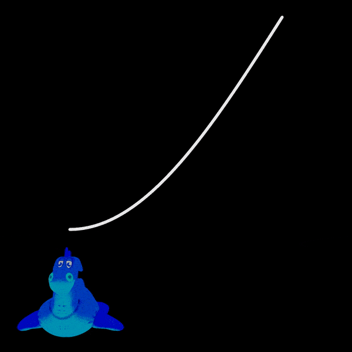

```js
float inSine(float x) {
	return 1 - cos((x * PI) / 2);
}
```

<br clear="left"/>

## Ease Out Sine

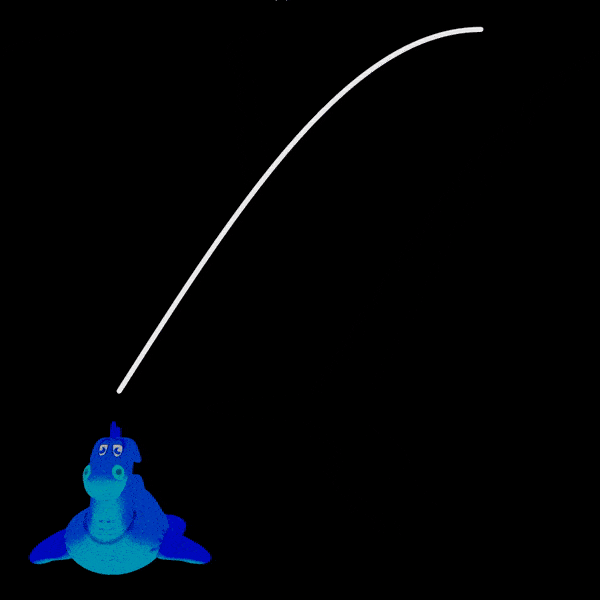

```js
float outSine(float x) {
	return sin((x * PI) / 2);
}
```

<br clear="left"/>

## Ease In/Out Sine

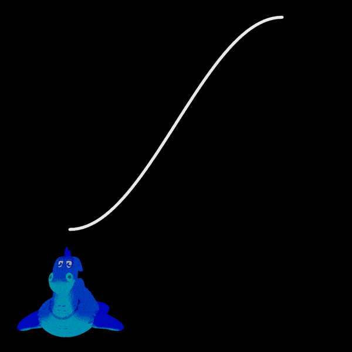

```js
float inOutSine(float x) {
	return -(cos(PI * x) - 1) / 2;
}
```

<br clear="left"/>

## Ease In Quad

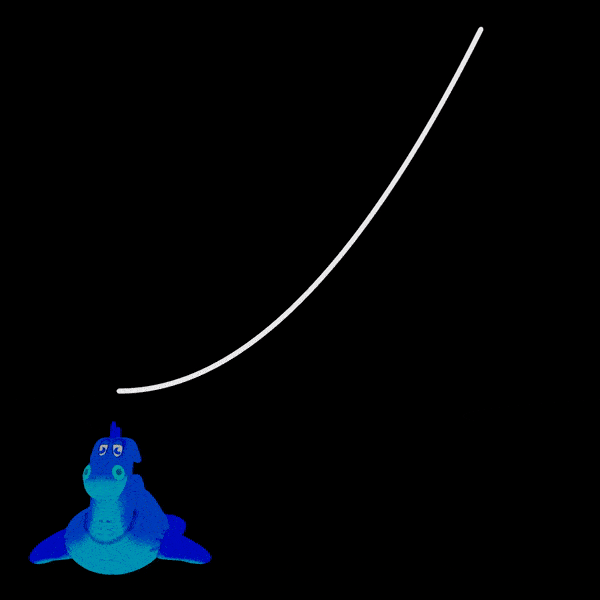

```js
float inQuad(float x) {
	return x * x;
}
```

<br clear="left"/>

## Ease Out Quad

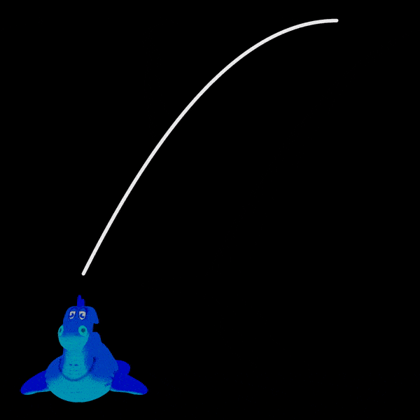

```js
float outQuad(float x) {
	return 1 - (1 - x) * (1 - x);
}
```

<br clear="left"/>

## Ease In/Out Quad

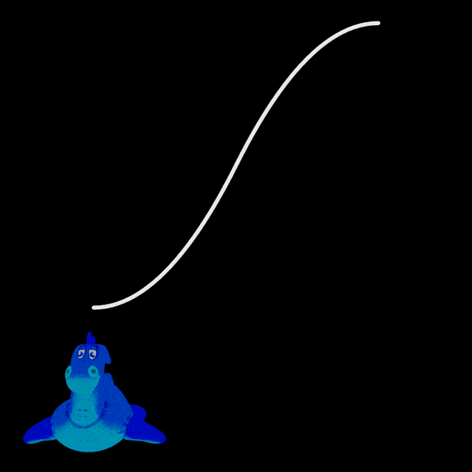

```js
float inOutQuad(float x) {
	return x < 0.5 ? 2 * x * x : 1 - pow(-2 * x + 2, 2) / 2;
}
```

<br clear="left"/>

## Ease In Cubic

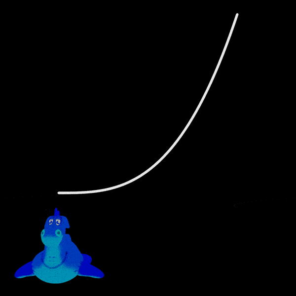

```js
float inCubic(float x) {
	return x * x * x;
}
```

<br clear="left"/>

## Ease Out Cubic

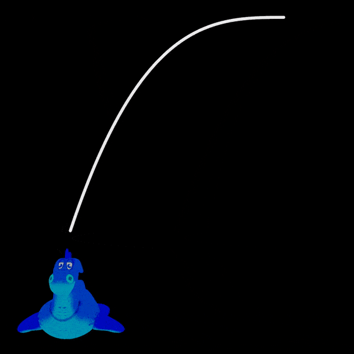

```js
float outCubic(float x) {
	return 1 - pow(1 - x, 3);
}
```

<br clear="left"/>

## Ease In/Out Cubic

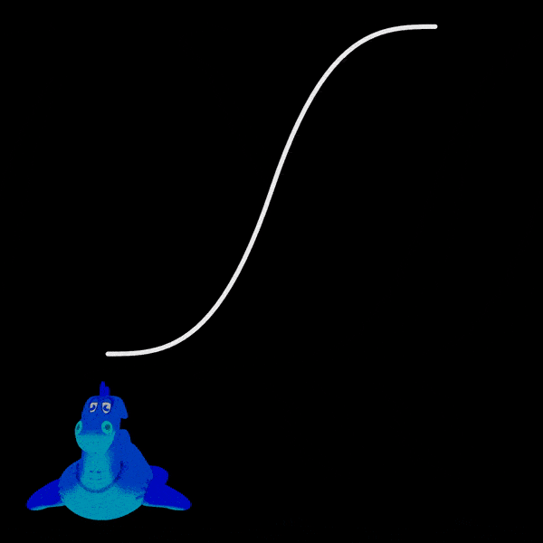

```js
float inOutCubic(float x) {
	return x < 0.5 ? 4 * x * x * x : 1 - pow(-2 * x + 2, 3) / 2;
}
```

<br clear="left"/>

## Ease In Quartic

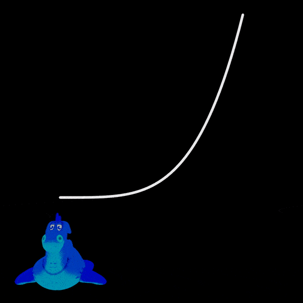

```js
float inQuart(float x) {
	return x * x * x * x;
}
```

<br clear="left"/>

## Ease Out Quartic

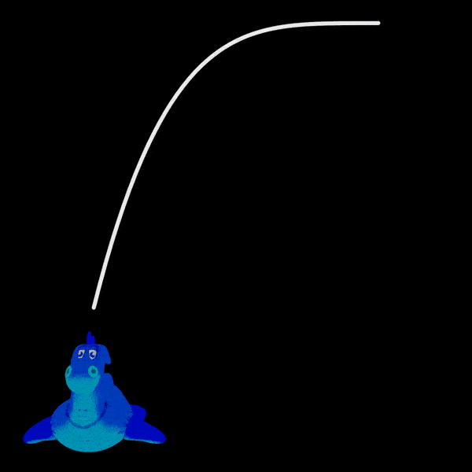

```js
float outQuart(float x) {
	return 1 - pow(1 - x, 4);
}
```

<br clear="left"/>

## Ease In/Out Quartic

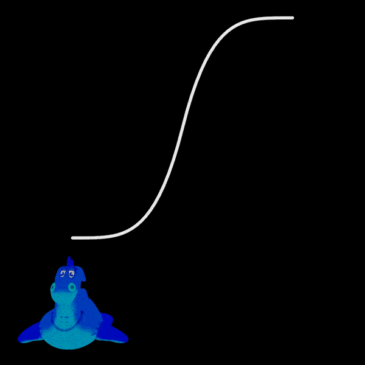

```js
float inOutQuart(float x) {
	return x < 0.5 ? 8 * x * x * x * x : 1 - pow(-2 * x + 2, 4) / 2;
}
```

<br clear="left"/>

## Ease In Quintic

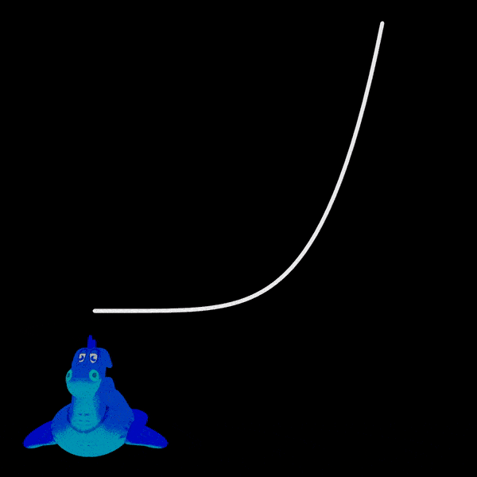

```js
float inQuint(float x) {
	return x * x * x * x * x;
}
```

<br clear="left"/>

## Ease Out Quintic

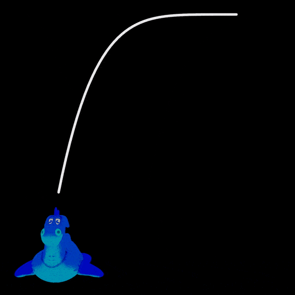

```js
float outQuint(float x) {
	return 1 - pow(1 - x, 5);
}
```

<br clear="left"/>

## Ease In/Out Quintic


```js
float inOutQuint(float x) {
	return x < 0.5 ? 16 * x * x * x * x * x : 1 - pow(-2 * x + 2, 5) / 2;
}
```

<br clear="left"/>

## Ease In Exponential

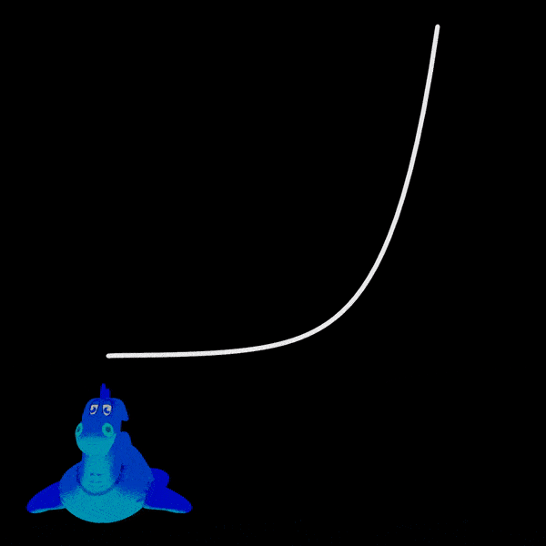

```js
float inExpo(float x) {
	return x == 0 ? 0 : pow(2, 10 * x - 10);
}
```

<br clear="left"/>

## Ease Out Exponential

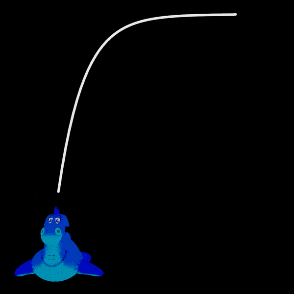

```js
float outExpo(float x) {
	return x == 1 ? 1 : 1 - pow(2, -10 * x);
}
```

<br clear="left"/>

## Ease In/Out Exponential

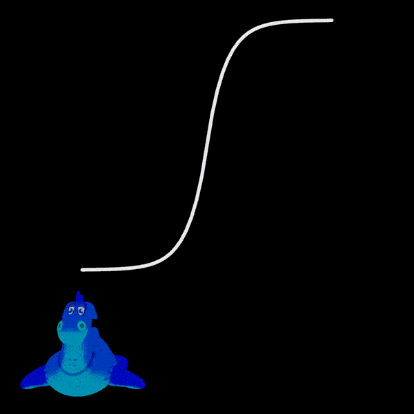

```js
float inOutExpo(float x) {
	return x == 0
		? 0
		: x == 1
		? 1
		: x < 0.5 ? pow(2, 20 * x - 10) / 2
		: (2 - pow(2, -20 * x + 10)) / 2;
}
```

<br clear="left"/>

## Ease In Circular

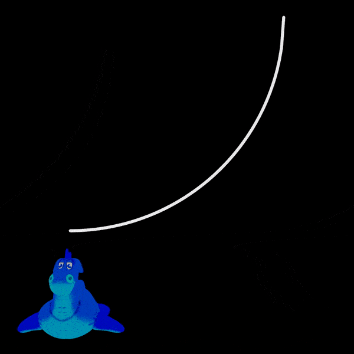

```js
float inCirc(float x) {
	return 1 - sqrt(1 - pow(x, 2));
}
```

<br clear="left"/>

## Ease Out Circular

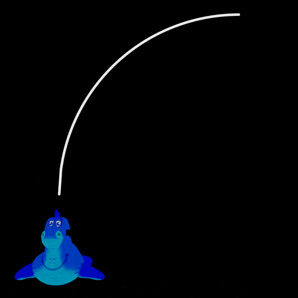

```js
float outCirc(float x) {
	return sqrt(1 - pow(x - 1, 2));
}
```

<br clear="left"/>

## Ease In/Out Circular

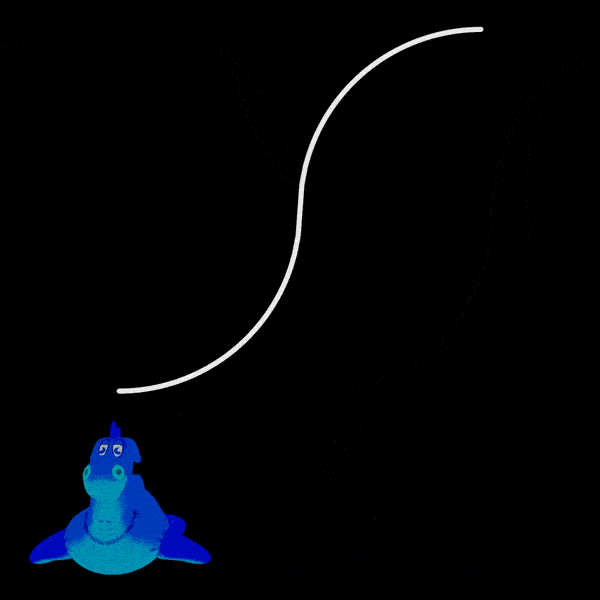

```js
float inOutCirc(float x) {
	return x < 0.5
		? (1 - sqrt(1 - pow(2 * x, 2))) / 2
		: (sqrt(1 - pow(-2 * x + 2, 2)) + 1) / 2;
}
```

<br clear="left"/>

## Ease In Back

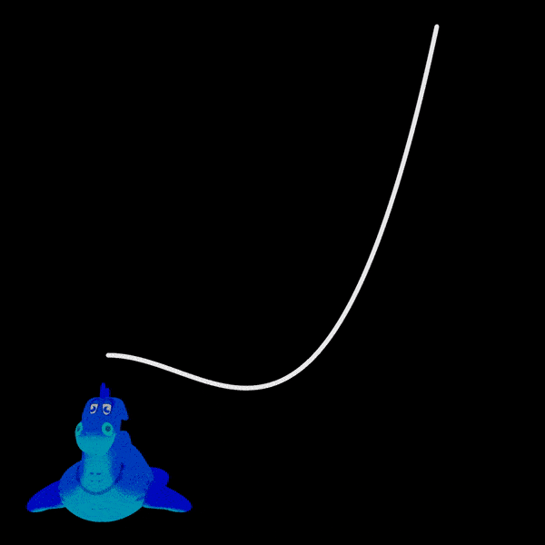

```js
float inBack(float x) {
	float c1 = 1.70158;
	float c3 = c1 + 1;
	return c3 * x * x * x - c1 * x * x;
}
```

<br clear="left"/>

## Ease Out Back

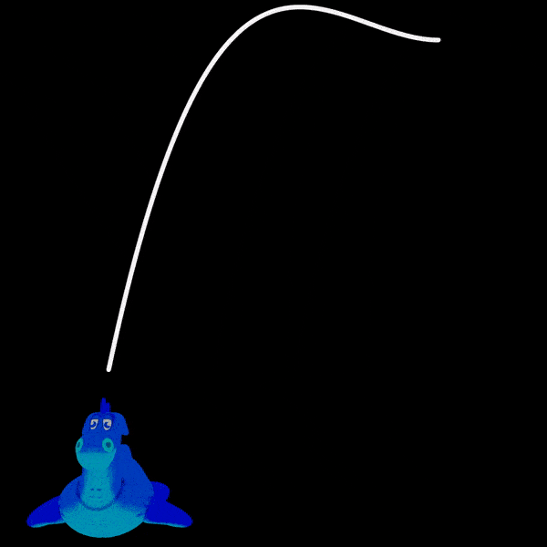

```js
float outBack(float x) {
	float c1 = 1.70158;
	float c3 = c1 + 1;
	return 1 + c3 * pow(x - 1, 3) + c1 * pow(x - 1, 2);
}
```

<br clear="left"/>

## Ease In/Out Back

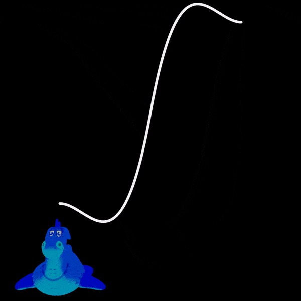

```js
float inOutBack(float x) {
	float c1 = 1.70158;
	float c2 = c1 * 1.525;
	return x < 0.5
		? (pow(2 * x, 2) * ((c2 + 1) * 2 * x - c2)) / 2
		: (pow(2 * x - 2, 2) * ((c2 + 1) * (x * 2 - 2) + c2) + 2) / 2;
}
```

<br clear="left"/>

## Ease In Elastic

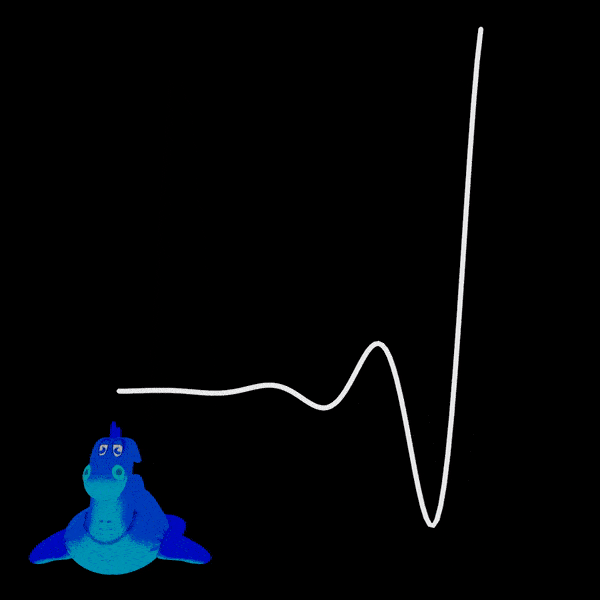

```js
float inElastic(float x) {
	float c4 = (2 * PI) / 3;
	return x == 0
		? 0
		: x == 1
		? 1
		: -pow(2, 10 * x - 10) * sin((x * 10 - 10.75) * c4);
}
```

<br clear="left"/>

## Ease Out Elastic

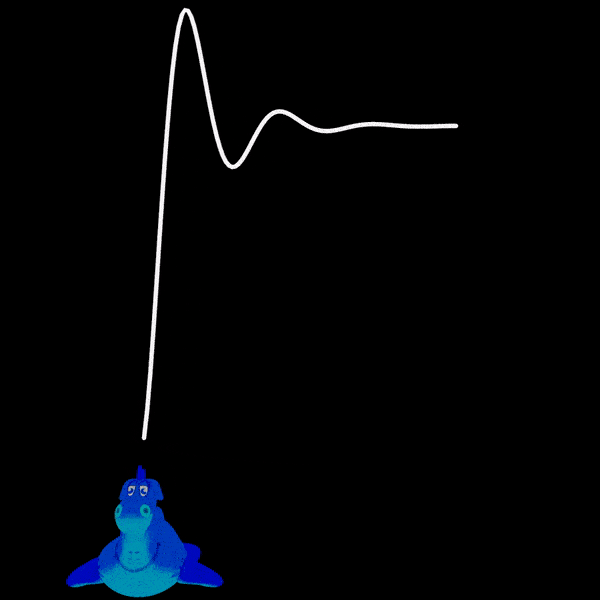

```js
float outElastic(float x) {
	float c4 = (2 * PI) / 3;
	return x == 0
		? 0
		: x == 1
		? 1
		: pow(2, -10 * x) * sin((x * 10 - 0.75) * c4) + 1;
}
```

<br clear="left"/>

## Ease In/Out Elastic

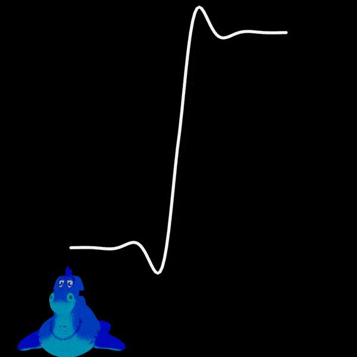

```js
float inOutElastic(float x) {
	float c5 = (2 * PI) / 4.5;
	return x == 0
		? 0
		: x == 1
		? 1
		: x < 0.5
		? -(pow(2, 20 * x - 10) * sin((20 * x - 11.125) * c5)) / 2
		: (pow(2, -20 * x + 10) * sin((20 * x - 11.125) * c5)) / 2 + 1;
}
```

<br clear="left"/>

## Ease In Bounce

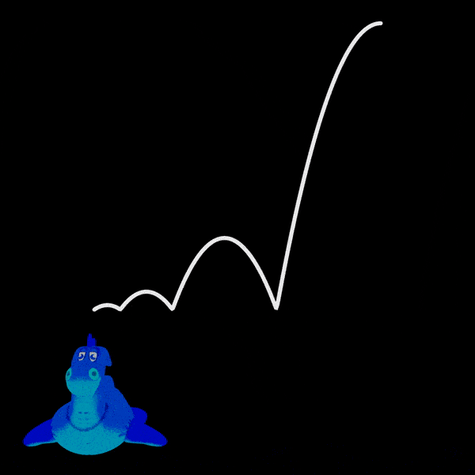

```js
float inBounce(float x) {
	return 1 - outBounce(1 - x);
}
```

<br clear="left"/>

## Ease Out Bounce

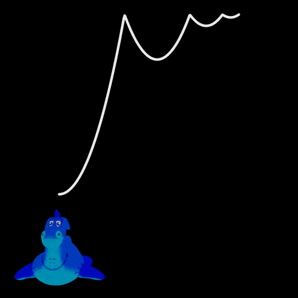

```js
float outBounce(float x) {
	float n1 = 7.5625;
	float d1 = 2.75;
	if (x < 1 / d1) {
		return n1 * x * x;
	} else if (x < 2 / d1) {
		float a = x - 1.5 / d1;
		return n1 * a * a + 0.75;
	} else if (x < 2.5 / d1) {
		float a = x - 2.25 / d1;
		return n1 * a * a + 0.9375;
	} else {
		float a = x - 2.625 / d1;
		return n1 * a * a + 0.984375;
	}
}
```

<br clear="left"/>

## Ease In/Out Bounce

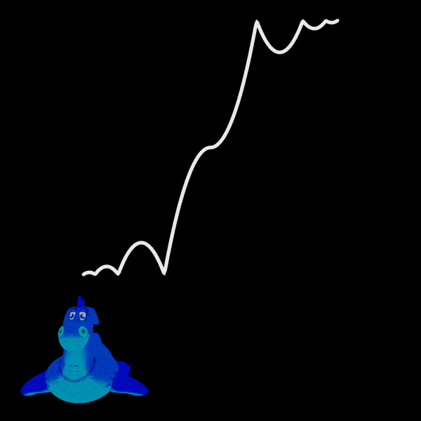

```js
float inOutBounce(float x) {
	return x < 0.5
		? (1 - outBounce(1 - 2 * x)) / 2
		: (1 + outBounce(2 * x - 1)) / 2;
}
```

<br clear="left"/>
