# Houdini Signed Distance Functions
Most SDFs are written directly, like [the classics from Inigo Quilez](https://iquilezles.org/articles/distfunctions/). Luckily they're easy to port to Houdini:

1. Add a VDB node. Set the class to 'Level Set' and the name to `surface`. 'Voxel Size' controls the quality:

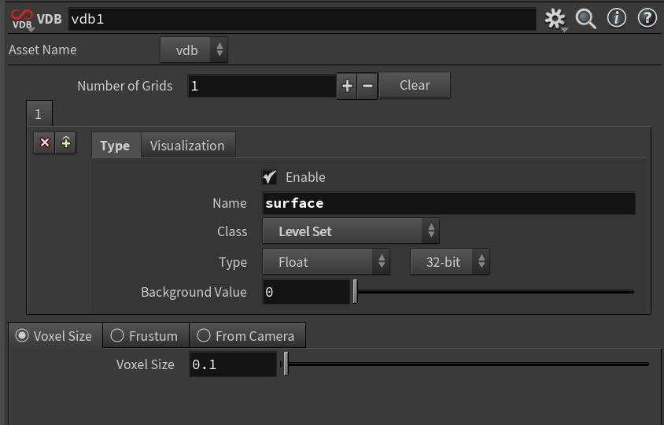

2. Add a VDB Activate node. Set the size of the VDB to anything above 0:

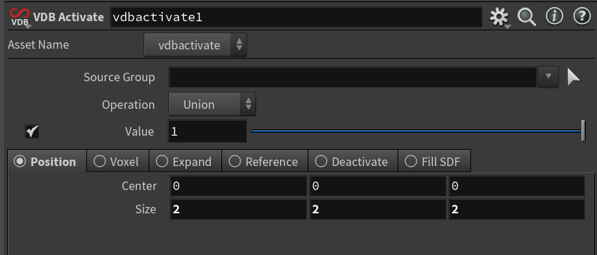

3. Add a Volume Wrangle. Here you define your SDF based on `@P`, for example a basic sphere:

```js
float sdSphere(vector p; float s) {
	return length(p) - s;
}

f@surface = sdSphere(v@P, 0.5);
```

4. Add a VDB Convert node set to 'Polygons' to convert it from a volume into geometry:

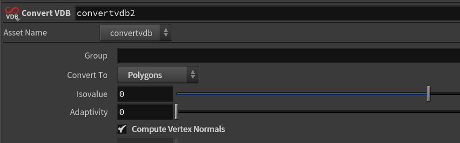

I did this for [a ton of SDFs](https://iquilezles.org/articles/distfunctions/) by Inigo Quilez. [Download the HIP file!](hips/sdfs/sdf_volumes.hipnc?raw=true)

[](hips/sdf_volumes.hipnc?raw=true)

## Sphere - exact

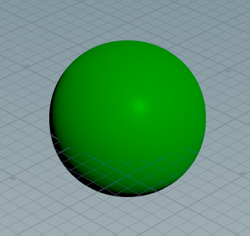

```js
// From https://iquilezles.org/articles/distfunctions
float sdSphere( vector p; float s ) {
	return length(p)-s;
}

f@surface = sdSphere(v@P, 1.0);
```

<br clear="left"/>

## Box - exact

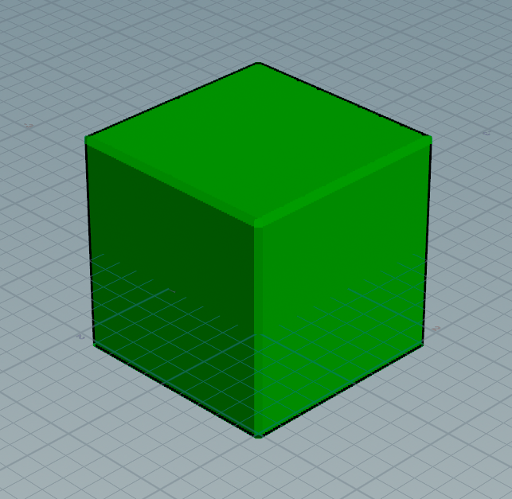

```js
// From https://iquilezles.org/articles/distfunctions
float sdBox( vector p; vector b ) {
	vector q = abs(p) - b;
	return length(max(q,0.0)) + min(max(q.x,q.y,q.z),0.0);
}

f@surface = sdBox(v@P, {1.0, 1.0, 1.0});
```

<br clear="left"/>

## Round Box - exact

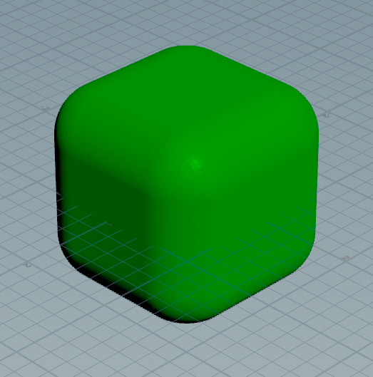

```js
// From https://iquilezles.org/articles/distfunctions
float sdRoundBox( vector p; vector b; float r ) {
	vector q = abs(p) - b;
	return length(max(q,0.0)) + min(max(q.x,q.y,q.z),0.0) - r;
}

f@surface = sdRoundBox(v@P, {0.5, 0.5, 0.5}, 0.5);
```

<br clear="left"/>

## Box Frame - exact

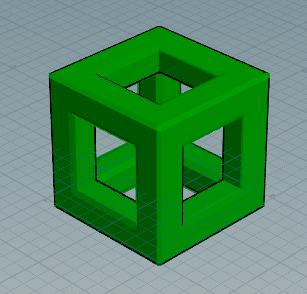

```js
// From https://iquilezles.org/articles/distfunctions
float sdBoxFrame( vector p; vector b; float e ) {
	p = abs(p)-b;
	vector q = abs(p+e)-e;
	return min(
		length(max(set(p.x,q.y,q.z),0.0))+min(max(p.x,q.y,q.z),0.0),
		length(max(set(q.x,p.y,q.z),0.0))+min(max(q.x,p.y,q.z),0.0),
		length(max(set(q.x,q.y,p.z),0.0))+min(max(q.x,q.y,p.z),0.0)
	);
}

f@surface = sdBoxFrame(v@P, {1.0, 1.0, 1.0}, 0.2);
```

<br clear="left"/>

## Torus - exact

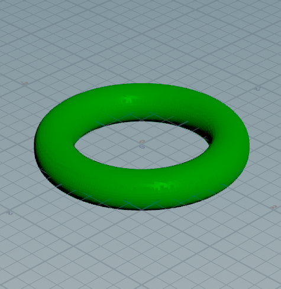

```js
// From https://iquilezles.org/articles/distfunctions
float sdTorus( vector p; vector2 t ) {
	vector2 q = set(length(set(p.x, p.z))-t.x,p.y);
	return length(q)-t.y;
}

f@surface = sdTorus(v@P, {1.0, 0.2});
```

<br clear="left"/>

## Capped Torus - exact

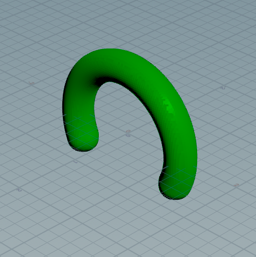

```js
// From https://iquilezles.org/articles/distfunctions
float sdCappedTorus( vector p; vector2 sc; float ra; float rb ) {
	p.x = abs(p.x);
	float k = (sc.y*p.x>sc.x*p.y) ? dot(set(p.x,p.y),sc) : length(set(p.x,p.y));
	return sqrt( dot(p,p) + ra*ra - 2.0*ra*k ) - rb;
}

f@surface = sdCappedTorus(v@P, set(sin(2.0), cos(2.0)), 1.0, 0.2);
```

<br clear="left"/>

## Link - exact

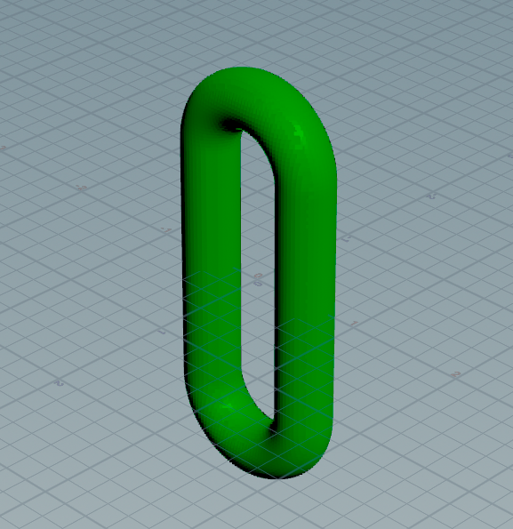

```js
// From https://iquilezles.org/articles/distfunctions
float sdLink( vector p; float le; float r1; float r2 ) {
	vector q = set( p.x, max(abs(p.y)-le,0.0), p.z );
	return length(set(length(set(q.x,q.y))-r1,q.z)) - r2;
}

f@surface = sdLink(v@P, 1.0, 0.5, 0.2);
```

<br clear="left"/>

## Cone - exact

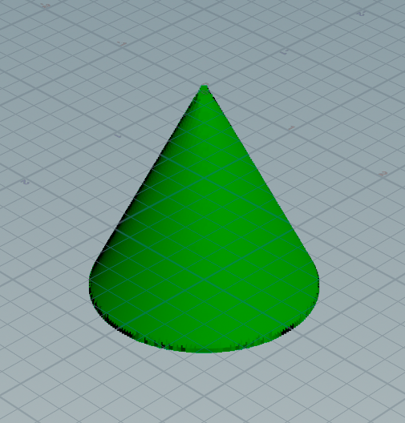

```js
// From https://iquilezles.org/articles/distfunctions
float sdCone( vector p; vector2 c; float h ) {
	// c is the sin/cos of the angle, h is height
	// Alternatively pass q instead of (c,h),
	// which is the point at the base in 2D
	vector2 q = h*set(c.x/c.y,-1.0);
	
	vector2 w = set( length(set(p.x,p.z)), p.y );
	vector2 a = w - q*clamp( dot(w,q)/dot(q,q), 0.0, 1.0 );
	vector2 b = w - q*set( clamp( w.x/q.x, 0.0, 1.0 ), 1.0 );
	float k = sign( q.y );
	float d = min(dot( a, a ),dot(b, b));
	float s = max( k*(w.x*q.y-w.y*q.x),k*(w.y-q.y)  );
	return sqrt(d)*sign(s);
}

f@surface = sdCone(v@P, {0.5, 1.0}, 2.0);
```

<br clear="left"/>

## Plane - exact

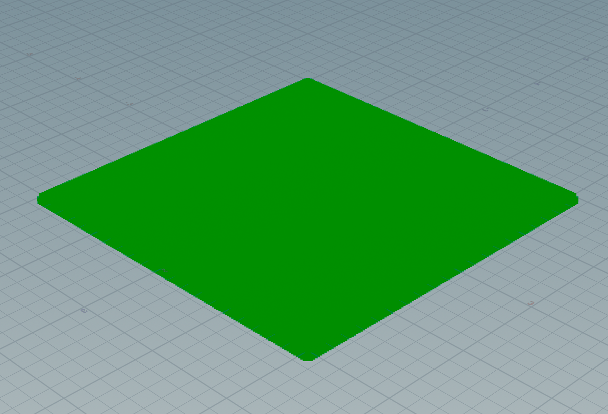

```js
// From https://iquilezles.org/articles/distfunctions
float sdPlane( vector p; vector n; float h ) {
	// n must be normalized
	return dot(p,n) + h;
}

f@surface = sdPlane(v@P, normalize({0.0, 1.0, 0.0}), 0.0);
```

<br clear="left"/>

## Hexagonal Prism - exact

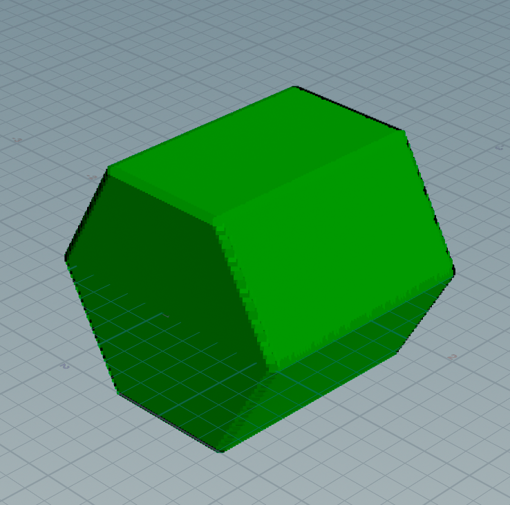

```js
// From https://iquilezles.org/articles/distfunctions
float sdHexPrism( vector p; vector2 h ) {
	vector k = {-0.8660254, 0.5, 0.57735};
	p = abs(p);
	p -= 2.0*min(dot(set(k.x,k.y), set(p.x,p.y)), 0.0)*set(k.x,k.y);
	vector2 d = set(
		length(set(p.x,p.y)-set(clamp(p.x,-k.z*h.x,k.z*h.x), h.x))*sign(p.y-h.x),
		p.z-h.y );
	return min(max(d.x,d.y),0.0) + length(max(d,0.0));
}

f@surface = sdHexPrism(v@P, {1.0, 1.0});
```

<br clear="left"/>

## Vertical Capsule / Line - exact

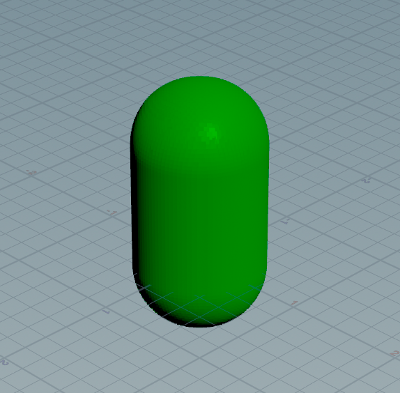

```js
// From https://iquilezles.org/articles/distfunctions
float sdVerticalCapsule( vector p; float h; float r ) {
	p.y -= clamp( p.y, 0.0, h );
	return length( p ) - r;
}

f@surface = sdVerticalCapsule(v@P, 1.0, 0.5);
```

<br clear="left"/>

## Arbitrary Capsule / Line - exact

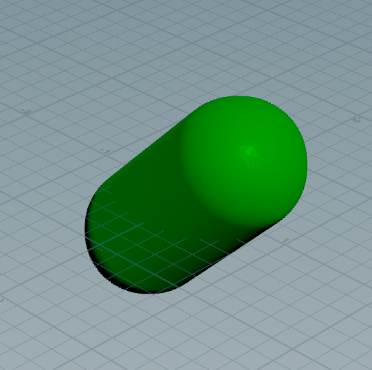

```js
// From https://iquilezles.org/articles/distfunctions
float sdCapsule( vector p; vector a; vector b; float r ) {
	vector pa = p - a, ba = b - a;
	float h = clamp( dot(pa,ba)/dot(ba,ba), 0.0, 1.0 );
	return length( pa - ba*h ) - r;
}

f@surface = sdCapsule(v@P, {-0.5, -0.5, 0.0}, {0.5, 0.5, 0.0}, 0.5);
```

<br clear="left"/>

## Vertical Capped Cylinder - exact

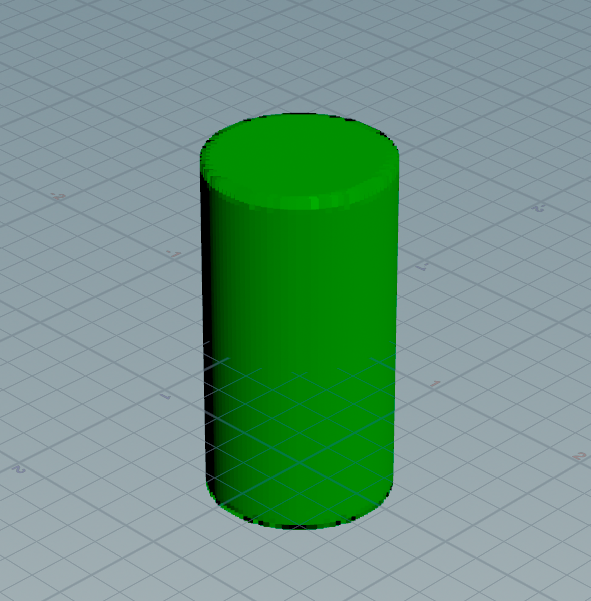

```js
// From https://iquilezles.org/articles/distfunctions
float sdCappedCylinder( vector p; float h; float r ) {
	vector2 d = abs(set(length(set(p.x,p.z)),p.y)) - set(r,h);
	return min(max(d.x,d.y),0.0) + length(max(d,0.0));
}

f@surface = sdCappedCylinder(v@P, 1.0, 0.5);
```

<br clear="left"/>

## Arbitrary Capped Cylinder - exact

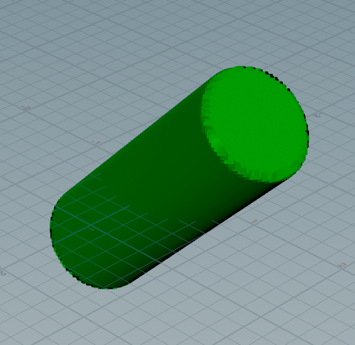

```js
// From https://iquilezles.org/articles/distfunctions
float sdCappedCylinder( vector p; vector a; vector b; float r ) {
	vector ba = b - a;
	vector pa = p - a;
	float baba = dot(ba,ba);
	float paba = dot(pa,ba);
	float x = length(pa*baba-ba*paba) - r*baba;
	float y = abs(paba-baba*0.5)-baba*0.5;
	float x2 = x*x;
	float y2 = y*y*baba;
	float d = (max(x,y)<0.0)?-min(x2,y2):(((x>0.0)?x2:0.0)+((y>0.0)?y2:0.0));
	return sign(d)*sqrt(abs(d))/baba;
}

f@surface = sdCappedCylinder(v@P, {-1.0, -1.0, 0.0}, {1.0, 1.0, 0.0}, 0.5);
```

<br clear="left"/>

## Rounded Cylinder - exact

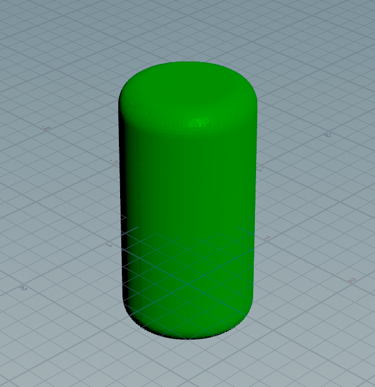

```js
// From https://iquilezles.org/articles/distfunctions
float sdRoundedCylinder( vector p; float ra; float rb; float h ) {
	vector2 d = set( length(set(p.x,p.z))-2.0*ra+rb, abs(p.y) - h );
	return min(max(d.x,d.y),0.0) + length(max(d,0.0)) - rb;
}

f@surface = sdRoundedCylinder(v@P, 0.3, 0.2, 1.0);
```

<br clear="left"/>

## Vertical Capped Cone - exact

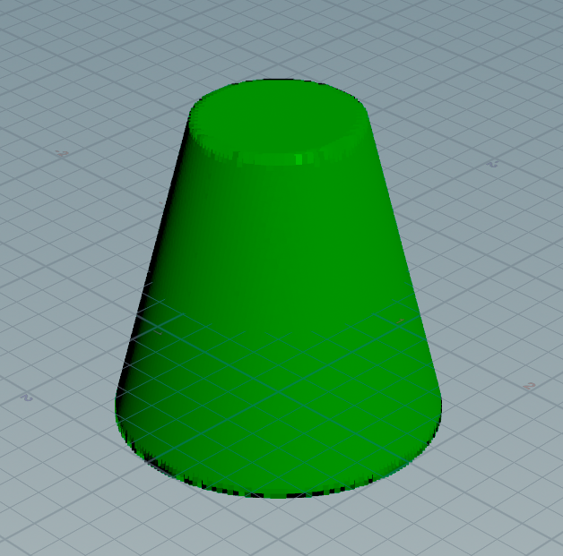

```js
// From https://iquilezles.org/articles/distfunctions
float sdCappedCone( vector p; float h; float r1; float r2 ) {
	vector2 q = set( length(set(p.x,p.z)), p.y );
	vector2 k1 = set(r2,h);
	vector2 k2 = set(r2-r1,2.0*h);
	vector2 ca = set(q.x-min(q.x,(q.y<0.0)?r1:r2), abs(q.y)-h);
	vector2 cb = q - k1 + k2*clamp( dot(k1-q,k2)/dot(k2,k2), 0.0, 1.0 );
	float s = (cb.x<0.0 && ca.y<0.0) ? -1.0 : 1.0;
	return s*sqrt( min(dot(ca,ca),dot(cb,cb)) );
}

f@surface = sdCappedCone(v@P, 1.0, 1.0, 0.5);
```

<br clear="left"/>

## Arbitrary Capped Cone - exact

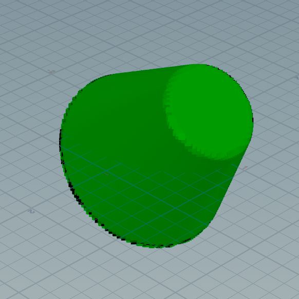

```js
// From https://iquilezles.org/articles/distfunctions
float sdCappedCone( vector p; vector a; vector b; float ra; float rb ) {
	float rba  = rb-ra;
	float baba = dot(b-a,b-a);
	float papa = dot(p-a,p-a);
	float paba = dot(p-a,b-a)/baba;
	float x = sqrt( papa - paba*paba*baba );
	float cax = max(0.0,x-((paba<0.5)?ra:rb));
	float cay = abs(paba-0.5)-0.5;
	float k = rba*rba + baba;
	float f = clamp( (rba*(x-ra)+paba*baba)/k, 0.0, 1.0 );
	float cbx = x-ra - f*rba;
	float cby = paba - f;
	float s = (cbx<0.0 && cay<0.0) ? -1.0 : 1.0;
	return s*sqrt( min(cax*cax + cay*cay*baba, cbx*cbx + cby*cby*baba) );
}

f@surface = sdCappedCone(v@P, {-0.5, -0.5, 0.0}, {0.5, 0.5, 0.0}, 1.0, 0.5);
```

<br clear="left"/>

## Solid Angle - exact

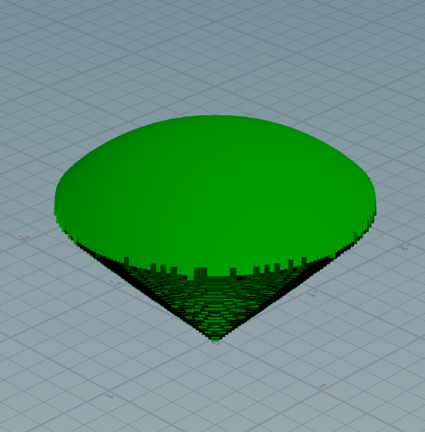

```js
// From https://iquilezles.org/articles/distfunctions
float sdSolidAngle( vector p; vector2 c; float ra ) {
	// c is the sin/cos of the angle
	vector2 q = set( length(set(p.x,p.z)), p.y );
	float l = length(q) - ra;
	float m = length(q - c*clamp(dot(q,c),0.0,ra) );
	return max(l,m*sign(c.y*q.x-c.x*q.y));
}

f@surface = sdSolidAngle(v@P, {1.0, 1.0}, 1.5);
```

<br clear="left"/>

## Cut Sphere - exact

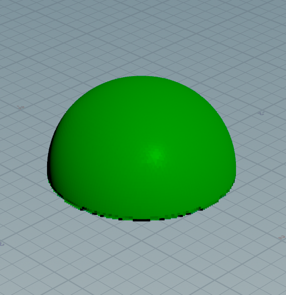

```js
// From https://iquilezles.org/articles/distfunctions
float sdCutSphere( vector p; float r; float h ) {
	// sampling independent computations (only depend on shape)
	float w = sqrt(r*r-h*h);
	
	// sampling dependant computations
	vector2 q = set( length(set(p.x,p.z)), p.y );
	float s = max( (h-r)*q.x*q.x+w*w*(h+r-2.0*q.y), h*q.x-w*q.y );
	return (s<0.0) ? length(q)-r : (q.x<w) ? h - q.y : length(q-set(w,h));
}

f@surface = sdCutSphere(v@P, 1.0, 0.0);
```

<br clear="left"/>

## Cut Hollow Sphere - exact

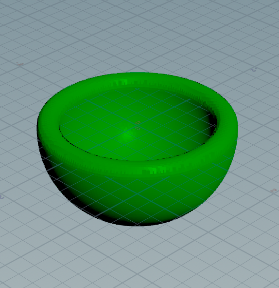

```js
// From https://iquilezles.org/articles/distfunctions
float sdCutHollowSphere( vector p; float r; float h; float t ) {
	// sampling independent computations (only depend on shape)
	float w = sqrt(r*r-h*h);
	
	// sampling dependant computations
	vector2 q = set( length(set(p.x,p.z)), p.y );
	return ((h*q.x<w*q.y) ? length(q-set(w,h)) : abs(length(q)-r) ) - t;
}

f@surface = sdCutHollowSphere(v@P, 1.0, 0.0, 0.1);
```

<br clear="left"/>

## Death Star - exact

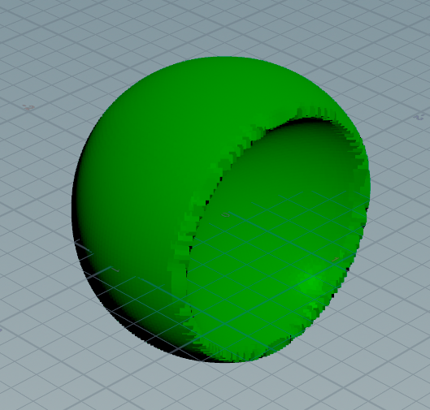

```js
// From https://iquilezles.org/articles/distfunctions
float sdDeathStar( vector p2; float ra; float rb; float d ) {
	// sampling independent computations (only depend on shape)
	float a = (ra*ra - rb*rb + d*d)/(2.0*d);
	float b = sqrt(max(ra*ra-a*a,0.0));
	
	// sampling dependant computations
	vector2 p = set( p2.x, length(set(p2.y,p2.z)) );
	if( p.x*b-p.y*a > d*max(b-p.y,0.0) )
		return length(p-set(a,b));
	else
		return max(length(p)-ra,-(length(p-set(d,0.0))-rb));
}

f@surface = sdDeathStar(v@P, 1.0, 1.0, 1.0);
```

<br clear="left"/>

## Vertical Round Cone - exact

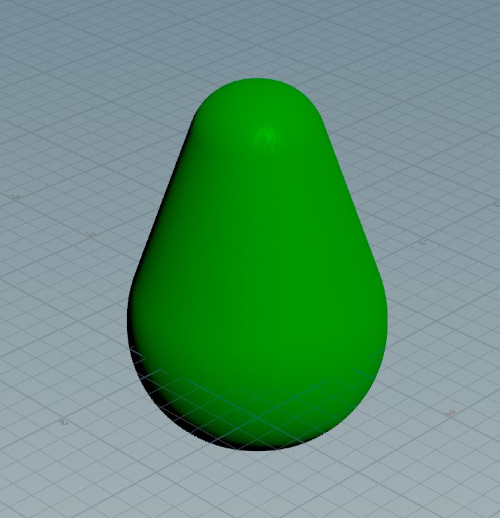

```js
// From https://iquilezles.org/articles/distfunctions
float sdRoundCone( vector p; float r1; float r2; float h ) {
	// sampling independent computations (only depend on shape)
	float b = (r1-r2)/h;
	float a = sqrt(1.0-b*b);
	
	// sampling dependant computations
	vector2 q = set( length(set(p.x,p.z)), p.y );
	float k = dot(q,set(-b,a));
	if( k<0.0 ) return length(q) - r1;
	if( k>a*h ) return length(q-set(0.0,h)) - r2;
	return dot(q, set(a,b) ) - r1;
}

f@surface = sdRoundCone(v@P, 1.0, 0.5, 1.5);
```

<br clear="left"/>

## Arbitrary Round Cone - exact

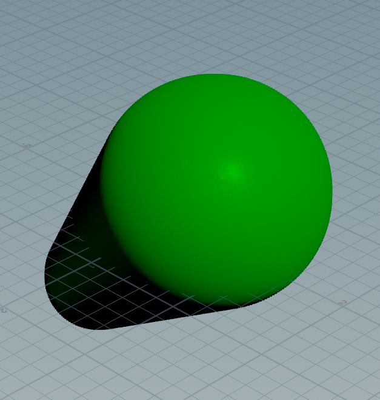

```js
// From https://iquilezles.org/articles/distfunctions
float sdRoundCone( vector p; vector a; vector b; float r1; float r2 ) {
	// sampling independent computations (only depend on shape)
	vector ba = b - a;
	float l2 = dot(ba,ba);
	float rr = r1 - r2;
	float a2 = l2 - rr*rr;
	float il2 = 1.0/l2;
	
	// sampling dependant computations
	vector pa = p - a;
	float y = dot(pa,ba);
	float z = y - l2;
	vector paba = pa*l2 - ba*y;
	float x2 = dot(paba,paba);
	float y2 = y*y*l2;
	float z2 = z*z*l2;
	
	// single square root!
	float k = sign(rr)*rr*rr*x2;
	if( sign(z)*a2*z2>k ) return  sqrt(x2 + z2) * il2 - r2;
	if( sign(y)*a2*y2<k ) return  sqrt(x2 + y2) * il2 - r1;
	return (sqrt(x2*a2*il2)+y*rr)*il2 - r1;
}

f@surface = sdRoundCone(v@P, {-1.0, -1.0, 0.0}, {0.5, 0.5, 0.0}, 0.5, 1.0);
```

<br clear="left"/>

## Revolved Vesica - exact

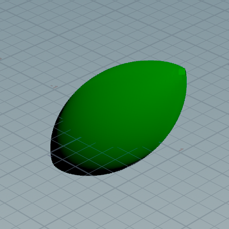

```js
// From https://iquilezles.org/articles/distfunctions
float sdVesicaSegment( vector p; vector a; vector b; float w ) {
	vector c = (a+b)*0.5;
	float  l = length(b-a);
	vector v = (b-a)/l;
	float  y = dot(p-c,v);
	vector q = set(length(p-c-y*v),abs(y));
	
	float r = 0.5*l;
	float d = 0.5*(r*r-w*w)/w;
	vector h = (r*q.x<d*(q.y-r)) ? set(0.0,r,0.0) : set(-d,0.0,d+w);
	
	return length(q-set(h.x,h.y)) - h.z;
}

f@surface = sdVesicaSegment(v@P, {-1.0, -1.0, 0.0}, {1.0, 1.0, 0.0}, 0.5);
```

<br clear="left"/>

## Rhombus - exact

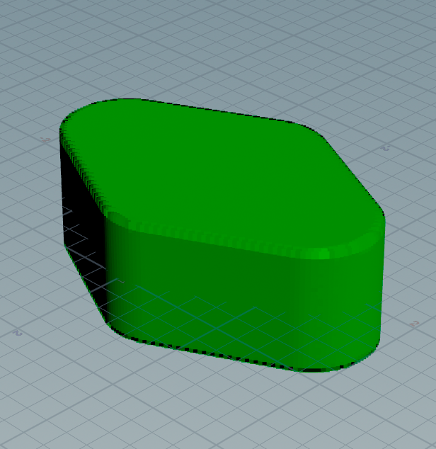

```js
// From https://iquilezles.org/articles/distfunctions
float ndot( vector2 a; vector2 b ) {
	return a.x*b.x - a.y*b.y;
}

float sdRhombus( vector p; float la; float lb; float h; float ra ) {
	p = abs(p);
	vector2 b = set(la,lb);
	float f = clamp( (ndot(b,b-2.0*set(p.x,p.z)))/dot(b,b), -1.0, 1.0 );
	vector2 q = set(length(set(p.x,p.z)-0.5*b*set(1.0-f,1.0+f))*sign(p.x*b.y+p.z*b.x-b.x*b.y)-ra, p.y-h);
	return min(max(q.x,q.y),0.0) + length(max(q,0.0));
}

f@surface = sdRhombus(v@P, 1.0, 0.5, 0.5, 0.5);
```

<br clear="left"/>

## Octahedron - exact

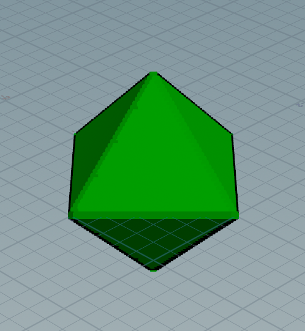

```js
// From https://iquilezles.org/articles/distfunctions
float sdOctahedron( vector p; float s ) {
	p = abs(p);
	float m = p.x+p.y+p.z-s;
	vector q;
	if( 3.0*p.x < m ) q = p.xyz;
	else if( 3.0*p.y < m ) q = p.yzx;
	else if( 3.0*p.z < m ) q = p.zxy;
	else return m*0.57735027;
	
	float k = clamp(0.5*(q.z-q.y+s),0.0,s);
	return length(set(q.x,q.y-s+k,q.z-k));
}

f@surface = sdOctahedron(v@P, 1.0);
```

<br clear="left"/>

## Pyramid - exact

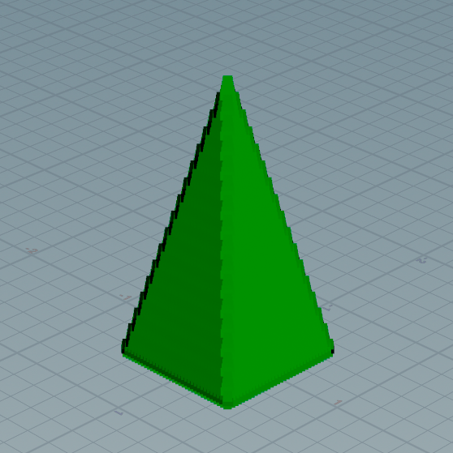

```js
// From https://iquilezles.org/articles/distfunctions
float sdPyramid( vector p; float h ) {
	float m2 = h*h + 0.25;
	
	p.x = abs(p.x);
	p.z = abs(p.z);
	p.x = (p.z>p.x) ? p.z : p.x;
	p.z = (p.z>p.x) ? p.x : p.z;
	p -= {0.5, 0.0, 0.5};
	
	vector q = set( p.z, h*p.y - 0.5*p.x, h*p.x + 0.5*p.y);
	
	float s = max(-q.x,0.0);
	float t = clamp( (q.y-0.5*p.z)/(m2+0.25), 0.0, 1.0 );
	
	float a = m2*(q.x+s)*(q.x+s) + q.y*q.y;
	float b = m2*(q.x+0.5*t)*(q.x+0.5*t) + (q.y-m2*t)*(q.y-m2*t);
	
	float d2 = min(q.y,-q.x*m2-q.y*0.5) > 0.0 ? 0.0 : min(a,b);
	
	return sqrt( (d2+q.z*q.z)/m2 ) * sign(max(q.z,-p.y));
}

f@surface = sdPyramid(v@P, 2.0);
```

<br clear="left"/>

## Triangle - exact

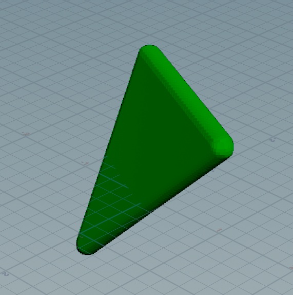

```js
// From https://iquilezles.org/articles/distfunctions
float dot2( vector v ) {
	return dot(v,v);
}

float udTriangle( vector p; vector a; vector b; vector c ) {
	vector ba = b - a; vector pa = p - a;
	vector cb = c - b; vector pb = p - b;
	vector ac = a - c; vector pc = p - c;
	vector nor = cross( ba, ac );
	
	return sqrt(
		(sign(dot(cross(ba,nor),pa)) +
		sign(dot(cross(cb,nor),pb)) +
		sign(dot(cross(ac,nor),pc))<2.0)
		?
		min(
		dot2(ba*clamp(dot(ba,pa)/dot2(ba),0.0,1.0)-pa),
		dot2(cb*clamp(dot(cb,pb)/dot2(cb),0.0,1.0)-pb),
		dot2(ac*clamp(dot(ac,pc)/dot2(ac),0.0,1.0)-pc) )
		:
		dot(nor,pa)*dot(nor,pa)/dot2(nor) );
}

float thickness = 0.1;
f@surface = udTriangle(v@P, {1.0, 1.0, 0.0}, {-1.0, -1.0, 0.0}, {-1.0, 1.0, -1.0}) - thickness;
```

<br clear="left"/>

## Quad - exact

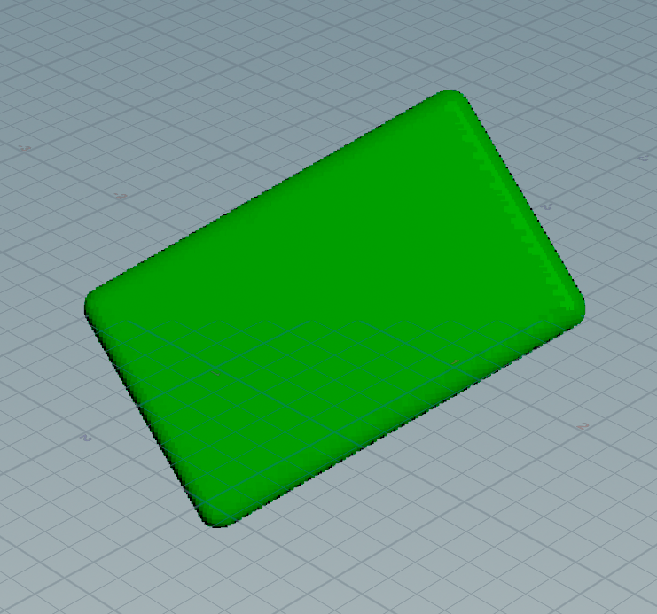

```js
// From https://iquilezles.org/articles/distfunctions
float dot2( vector v ) {
	return dot(v,v);
}

float udQuad( vector p; vector a; vector b; vector c; vector d ) {
	vector ba = b - a; vector pa = p - a;
	vector cb = c - b; vector pb = p - b;
	vector dc = d - c; vector pc = p - c;
	vector ad = a - d; vector pd = p - d;
	vector nor = cross( ba, ad );
	
	return sqrt(
		(sign(dot(cross(ba,nor),pa)) +
		sign(dot(cross(cb,nor),pb)) +
		sign(dot(cross(dc,nor),pc)) +
		sign(dot(cross(ad,nor),pd))<3.0)
		?
	        min(
	        dot2(ba*clamp(dot(ba,pa)/dot2(ba),0.0,1.0)-pa),
	        dot2(cb*clamp(dot(cb,pb)/dot2(cb),0.0,1.0)-pb),
	        dot2(dc*clamp(dot(dc,pc)/dot2(dc),0.0,1.0)-pc),
	        dot2(ad*clamp(dot(ad,pd)/dot2(ad),0.0,1.0)-pd) )
		:
		dot(nor,pa)*dot(nor,pa)/dot2(nor) );
}

float thickness = 0.1;
f@surface = udQuad(v@P, {1.0, 0.0, -1.0}, {0.0, 1.0, -1.0}, {-1.0, 0.0, 1.0}, {0.0, -1.0, 1.0}) - thickness;
```

<br clear="left"/>

## Chain - exact

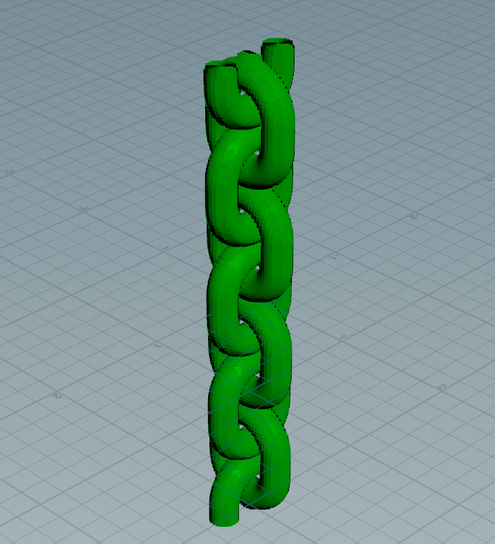

```js
// From https://www.shadertoy.com/view/wlXSD7
float sdChain( vector pos; float le; float r1; float r2 ) {
	float ya = max(abs(frac(pos.y    )-0.5)-le,0.0);
	float yb = max(abs(frac(pos.y+0.5)-0.5)-le,0.0);
	
	float la = ya*ya - 2.0*r1*sqrt(pos.x*pos.x+ya*ya);
	float lb = yb*yb - 2.0*r1*sqrt(pos.z*pos.z+yb*yb);
	
	vector2 xz = set(pos.x, pos.z);
	return sqrt(dot(xz,xz) + r1*r1 + min(la,lb)) - r2;
}

f@surface = sdChain(v@P, 0.1, 0.3, 0.1);
```

<br clear="left"/>

## Octagonal Prism - exact

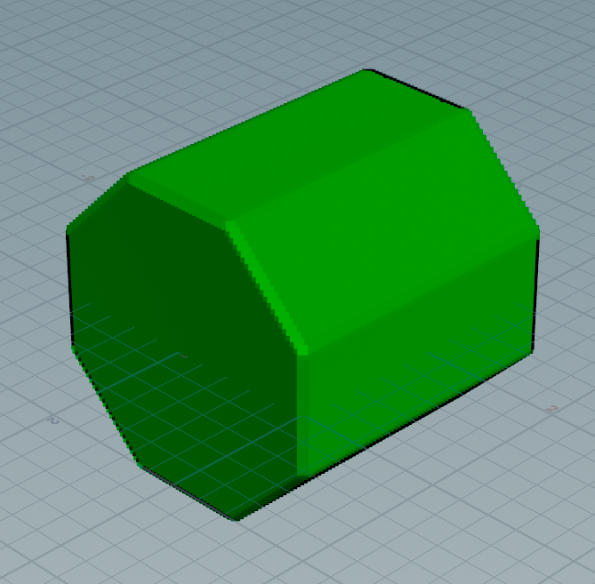

```js
// From https://www.shadertoy.com/view/Xds3zN
float sdOctagonPrism( vector p; float r; float h ) {
	vector k = set(-0.9238795325,   // sqrt(2+sqrt(2))/2 
					0.3826834323,   // sqrt(2-sqrt(2))/2
					0.4142135623 ); // sqrt(2)-1 
	// reflections
	p = abs(p);
	vector2 first = 2.0*min(dot(set(k.x,k.y),set(p.x,p.y)),0.0)*set(k.x,k.y);
	p.x -= first.x;
	p.y -= first.y;
	vector2 second = 2.0*min(dot(set(-k.x,k.y),set(p.x,p.y)),0.0)*set(-k.x,k.y);
	p.x -= second.x;
	p.y -= second.y;
	// polygon side
	vector2 third = set(clamp(p.x, -k.z*r, k.z*r), r);
	p.x -= third.x;
	p.y -= third.y;
	vector2 d = set( length(set(p.x,p.y))*sign(p.y), p.z-h );
	return min(max(d.x,d.y),0.0) + length(max(d,0.0));
}

f@surface = sdOctagonPrism(v@P, 1.0, 1.0);
```

<br clear="left"/>

## Horseshoe - exact

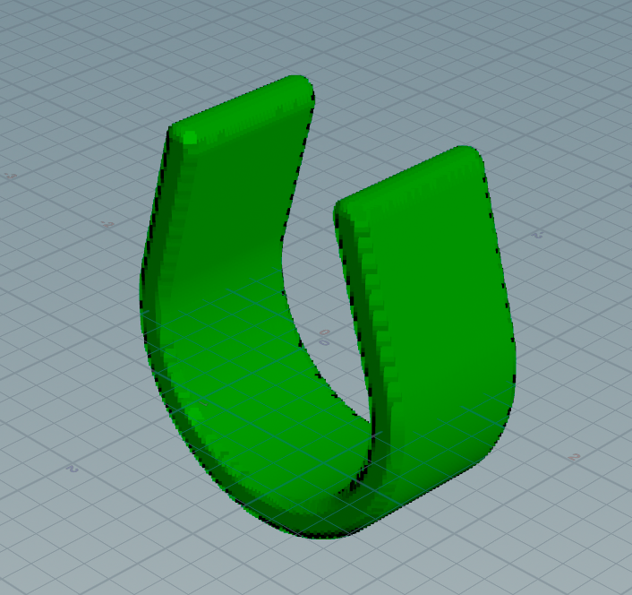

```js
// From https://www.shadertoy.com/view/Xds3zN
float sdHorseshoe( vector p; vector2 c; float r; float le; vector2 w ) {
	p.x = abs(p.x);
	float l = length(set(p.x,p.y));
	vector2 m = set(-c.x, c.y, c.y, c.x)*set(p.x,p.y); 
	p.x = m.x;
	p.y = m.y;
	p.x = (p.y>0.0 || p.x>0.0)?p.x:l*sign(-c.x);
	p.y = (p.x>0.0)?p.y:l;
	p.x = p.x - le;
	p.y = abs(p.y-r);
	
	vector2 q = set(length(max(set(p.x,p.y),0.0)) + min(0.0,max(p.x,p.y)),p.z);
	vector2 d = abs(q) - w;
	return min(max(d.x,d.y),0.0) + length(max(d,0.0));
}

f@surface = sdHorseshoe(v@P, set(cos(1.3), sin(1.3)), 1.0, 1.0, {0.1, 0.5});
```

<br clear="left"/>

## Infinite Cone - exact

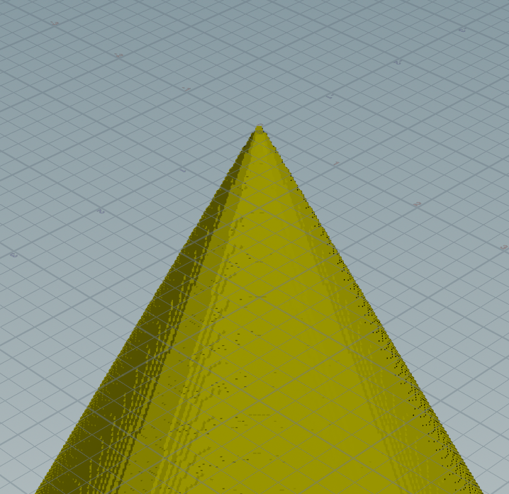

```js
// From https://iquilezles.org/articles/distfunctions
float sdCone( vector p; vector2 c ) {
	// c is the sin/cos of the angle
	vector2 q = set( length(set(p.x,p.z)), -p.y );
	float d = length(q-c*max(dot(q,c), 0.0));
	return d * ((q.x*c.y-q.y*c.x<0.0)?-1.0:1.0);
}

f@surface = sdCone(v@P, {0.5, 1.0});
```

<br clear="left"/>

## Infinite Cylinder - exact

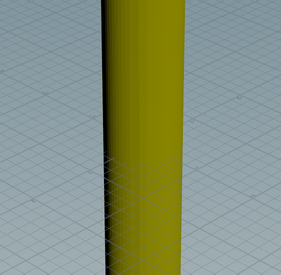

```js
// From https://iquilezles.org/articles/distfunctions
float sdCylinder( vector p; vector c ) {
	return length(set(p.x,p.z)-set(c.x,c.y))-c.z;
}

f@surface = sdCylinder(v@P, {0.0, 0.0, 0.5});
```

<br clear="left"/>

## Cone - bound (not exact)

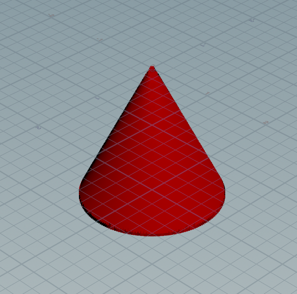

```js
// From https://iquilezles.org/articles/distfunctions
float sdCone( vector p; vector2 c; float h ) {
  float q = length(set(p.x,p.z));
  return max(dot(c.xy,set(q,p.y)),-h-p.y);
}

f@surface = sdCone(v@P, {0.5, 0.25}, 2.0);
```

<br clear="left"/>

## Triangular Prism - bound (not exact)

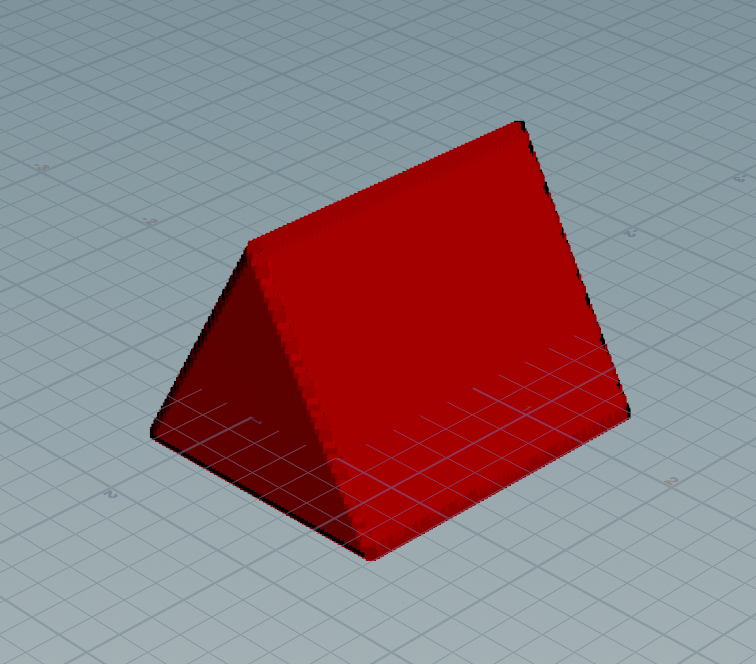

```js
// From https://iquilezles.org/articles/distfunctions
float sdTriPrism( vector p; vector2 h ) {
	vector q = abs(p);
	return max(q.z-h.y,max(q.x*0.866025+p.y*0.5,-p.y)-h.x*0.5);
}

f@surface = sdTriPrism(v@P, {1.0, 1.0});
```

<br clear="left"/>

## Ellipsoid - bound (not exact)

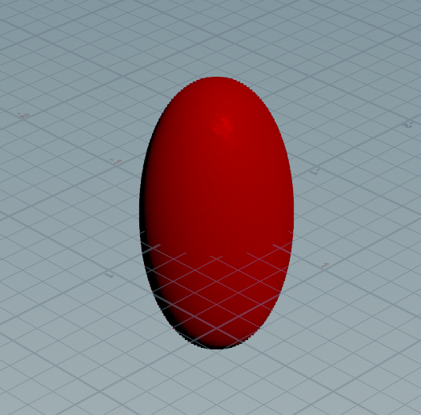

```js
// From https://iquilezles.org/articles/distfunctions
float sdEllipsoid( vector p; vector r ) {
  float k0 = length(p/r);
  float k1 = length(p/(r*r));
  return k0*(k0-1.0)/k1;
}

f@surface = sdEllipsoid(v@P, {0.5, 1.0, 0.5});
```

<br clear="left"/>

## Octahedron - bound (not exact)

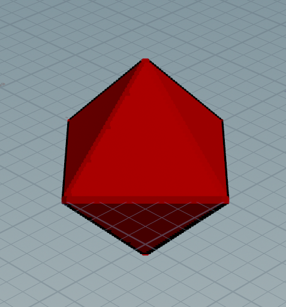

```js
// From https://iquilezles.org/articles/distfunctions
float sdOctahedron( vector p; float s ) {
	p = abs(p);
	return (p.x+p.y+p.z-s)*0.57735027;
}

f@surface = sdOctahedron(v@P, 1.0);
```

<br clear="left"/>

## Helix - bound (not exact)

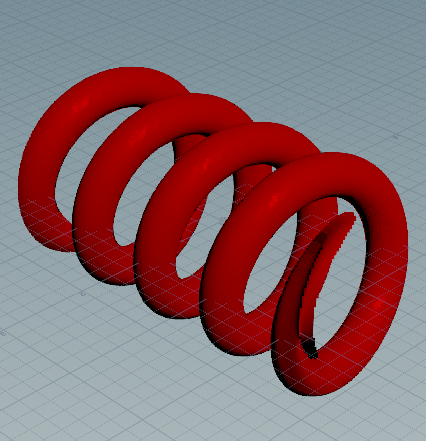

```js
// From https://www.shadertoy.com/view/ftyBRd
float sdHelix( vector p; float fr; float r1; float r2 ) {
	vector2 nline = set(fr, 6.283185*r1 );
	vector2 pline = set(nline.y, -nline.x);
	float repeat = nline.x*nline.y;
	
	vector2  pc = set(p.x,r1*atan(p.y,p.z));              // to cylindrical
	
	vector2  pp = set( dot(pc,pline),                     // project to line
	dot(pc,nline));
	
	pp.x = rint(pp.x/repeat)*repeat;                   // repeat in x
	
	vector2 qc = (nline*pp.y+pline*pp.x)/dot(nline,nline); // un project to cylindrical
	qc.y /= r1;
	
	vector q = set(qc.x, sin(qc.y)*r1, cos(qc.y)*r1 );   // to cartesian
	
	return length(p-q)-r2;
}

f@surface = sdHelix(v@P, 1.0, 1.0, 0.2);
```

<br clear="left"/>
