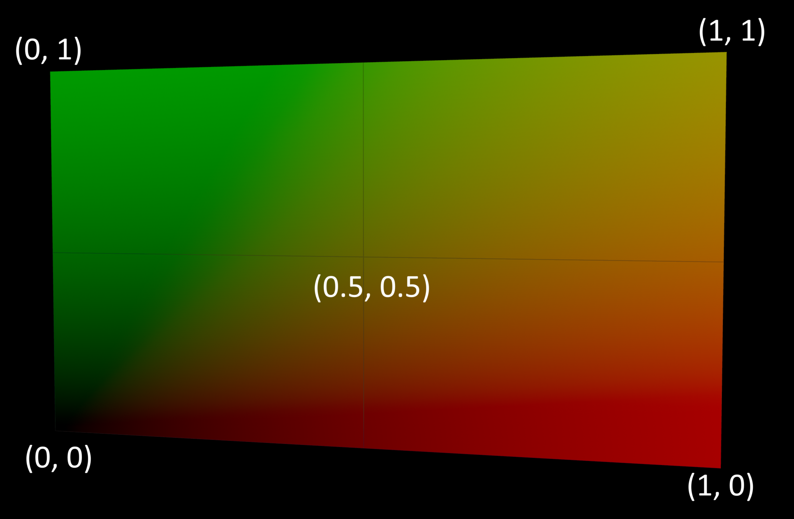
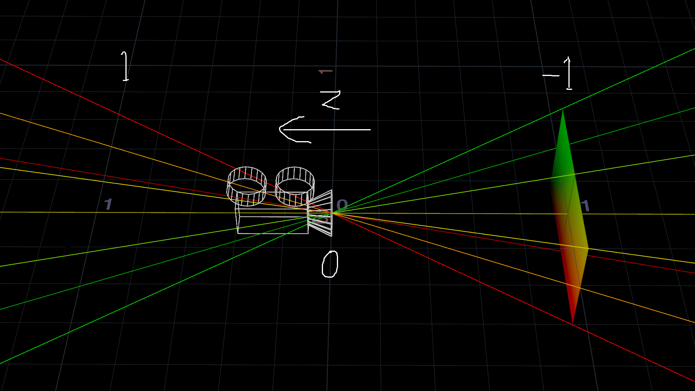
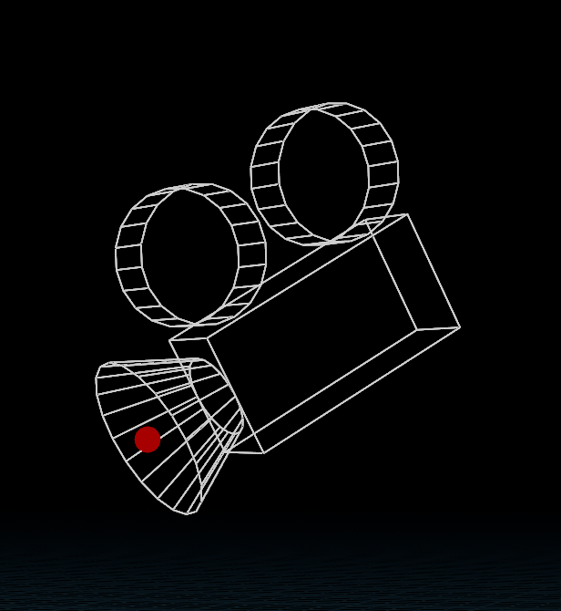
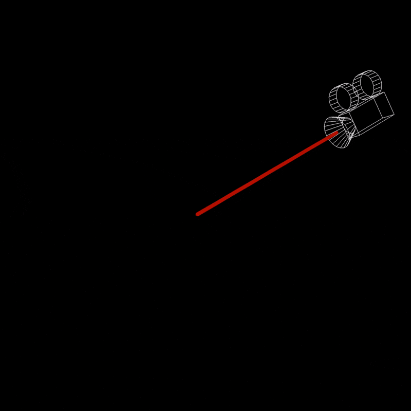
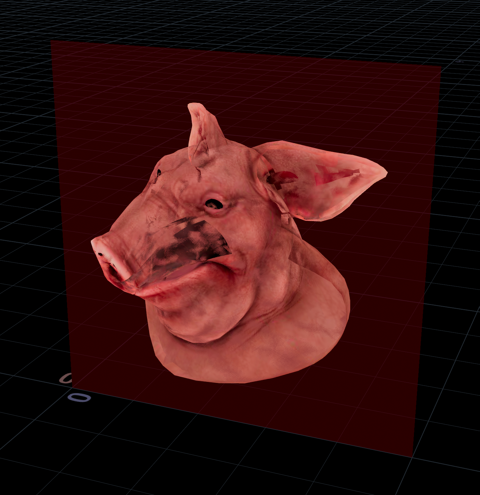
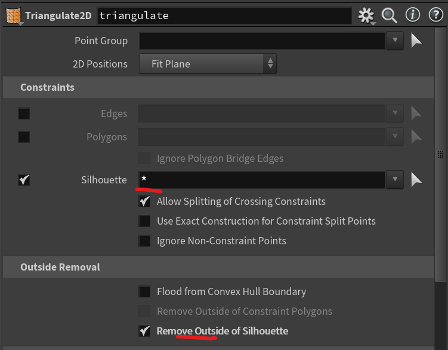
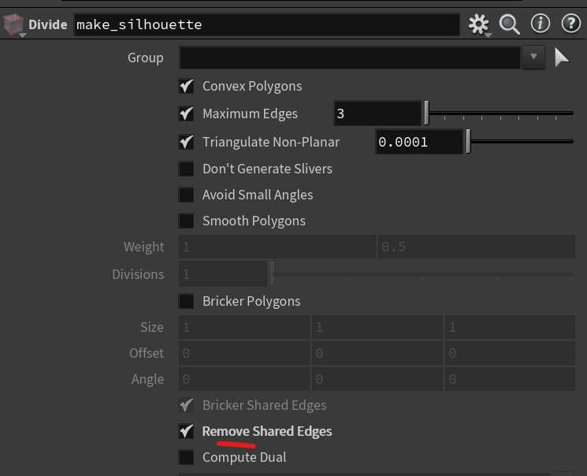
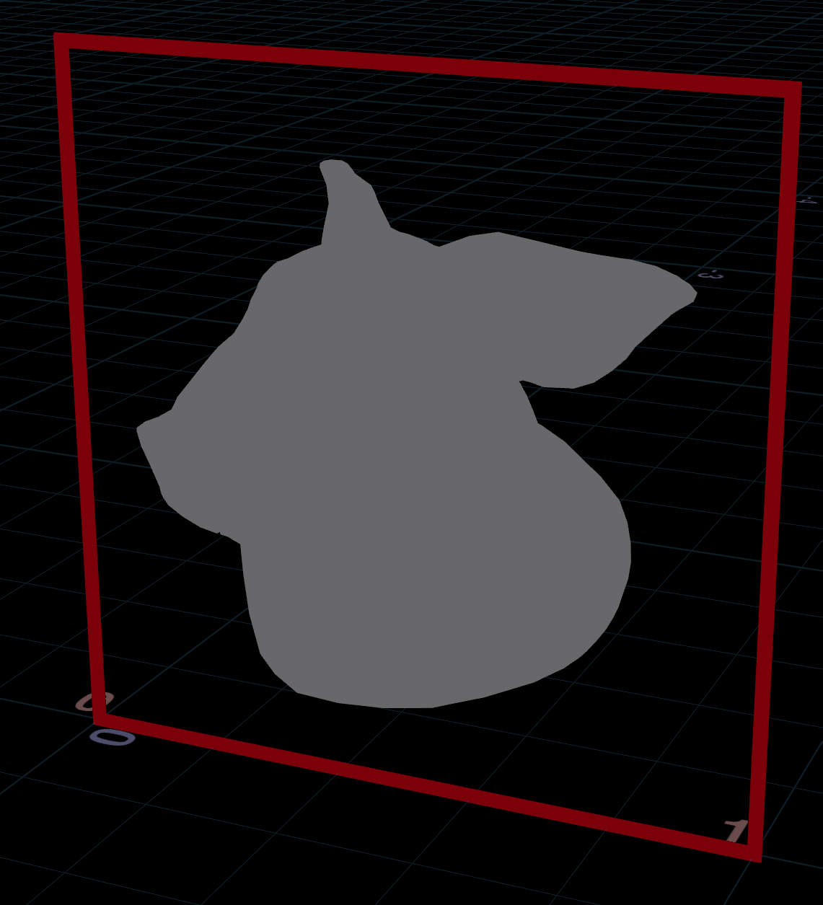
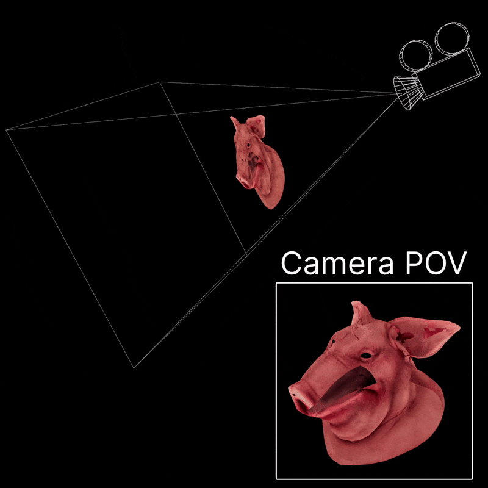

# Houdini Normalized Device Coordinates
NDC is a screen space coordinate system, great for perspective illusions and raycasting tricks.

X and Y represent the 2D screen coordinates, while Z represents the distance to the camera.


The X and Y coordinates are normalized between 0 and 1, with 0.5 in the middle.



The Z coordinates are 0 at the camera, negative in front and positive behind the camera. Why negative? No idea!



## Converting NDC
You can convert a world space coordinate to NDC using `toNDC()`:

```js
vector ndcPos = toNDC("/obj/cam1", v@P);
```

Then convert it back to world space using `fromNDC()`:

```js
vector worldPos = fromNDC("/obj/cam1", ndcPos);
```

Here's some fun NDC tricks you can play with. [Download the HIP file!](./hips/ndcfun.hipnc?raw=true)

## Get the camera position

The origin of NDC space is the camera, so just convert `{0, 0, 0}` to world space.



```js
// Run this in a detail wrangle
string cam = "/obj/cam1";
vector camPos = fromNDC(cam, {0, 0, 0});
addpoint(0, camPos);
```

`{0.5, 0.5, 0}` is technically more correct, but gives the same result.

<br clear="left"/>

## Draw a ray from the camera

The Z axis aligns with the camera direction, so move along it to draw a ray.



```js
// Run this in a detail wrangle
string cam = chs("cam");
float offset = chf("raylength");

// Sample two positions along the Z axis in NDC space to draw a ray
vector camPos = fromNDC(cam, {0.5, 0.5, 0});
vector camPos2 = fromNDC(cam, set(0.5, 0.5, -offset));

int a = addpoint(0, camPos);
int b = addpoint(0, camPos2);

addprim(0, "polyline", a, b);
```

<br clear="left"/>

## Flatten to the XY plane

Using NDC coordinates directly in world space flattens the geometry to how it looks on screen, like a printed photo.



```js
string cam = chs("cam");

// Flatten by setting Z to a constant value
v@P = toNDC(cam, v@P);
v@P.z = 0;
```

<br clear="left" />

Another trick is turning this into an outline, much like Labs Extract Silouette.

1. Add a Triangulate2D node. Set "Silhouette" to `*` and enable outside removal. This triangulates the mesh.

|||

2. Add a Divide node set to "Remove Shared Edges". This wipes the interior triangles and produces a clean outline.

|||

## Flatten to the camera plane

Using NDC coordinates in camera space lets you flatten geometry while keeping it identical from the camera perspective.



```js
string cam = chs("cam");
float offset = ch("distance");

// Flatten to camera by setting Z to a constant value
vector p = toNDC(cam, v@P);
p.z = -offset;

v@P = fromNDC(cam, p);
```

<br clear="left" />
