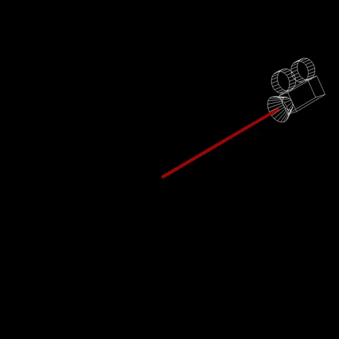
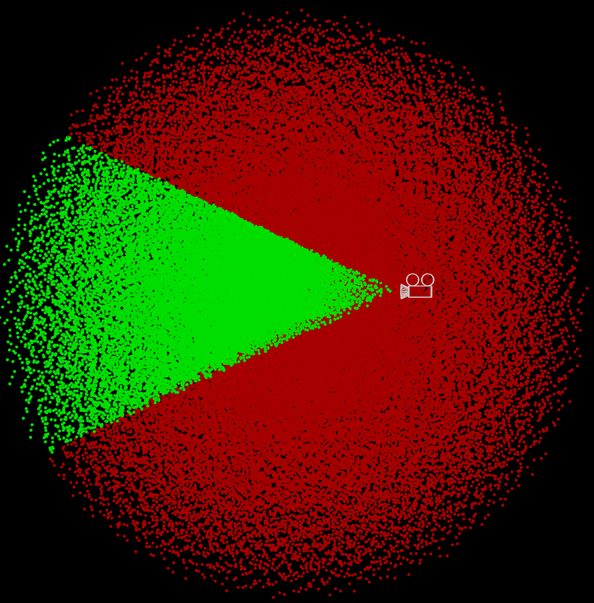
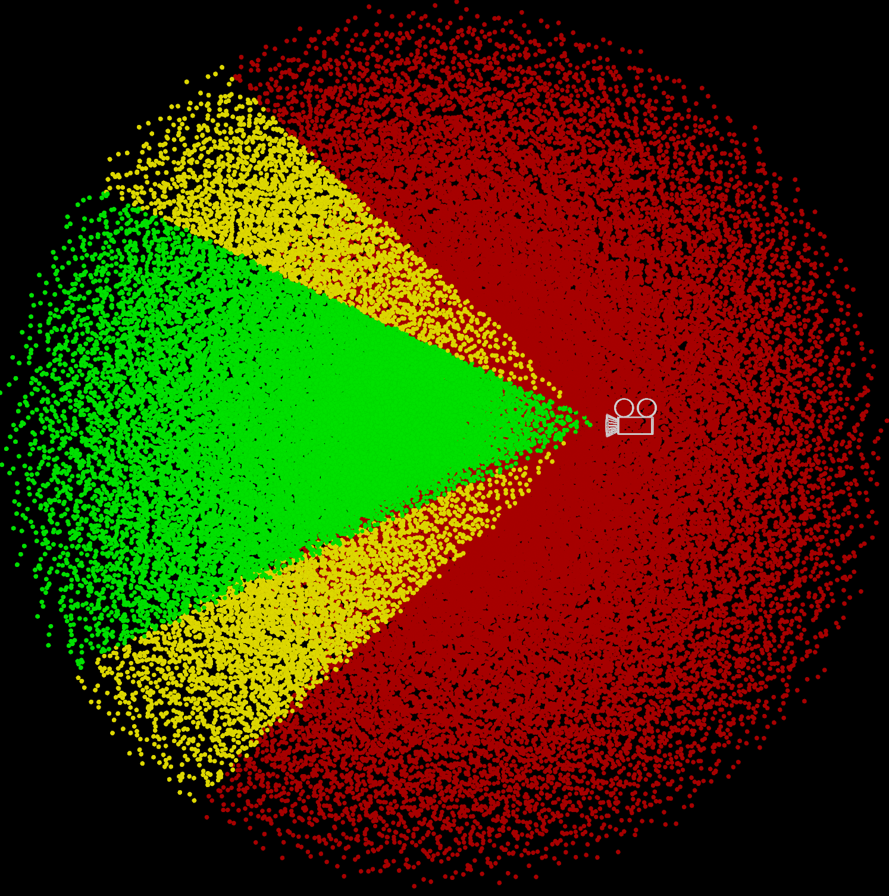

# Houdini Normalized Device Coordinates

NDC is a screen space coordinate system, great for perspective illusions and raycasting tricks.

X and Y represent the 2D screen coordinates, while Z represents the distance to the camera.


The X and Y coordinates are normalized between 0 and 1, with 0.5 in the middle.


The Z coordinates are 0 at the camera, negative in front and positive behind the camera. Why negative? No idea!


## Converting NDC

You can convert a world space coordinate to NDC using `toNDC()`:

```js
vector ndcPos = toNDC(chsop("cam"), v@P);
```

Then convert it back to world space using `fromNDC()`:

```js
vector worldPos = fromNDC(chsop("cam"), ndcPos);
```

Here's some NDC tricks you can play with. [Download the HIP file!](./hips/ndc/ndcfun.hipnc?raw=true)

## Get the camera position

The origin of NDC space is the camera, so just convert `{0, 0, 0}` to world space.


```js
// Run this in a detail wrangle
string cam = chsop("cam");
vector camPos = fromNDC(cam, {0, 0, 0});
addpoint(0, camPos);
```

`{0.5, 0.5, 0}` is technically more correct, but gives the same result.

<br clear="left"/>

## Draw a ray from the camera

The Z axis aligns with the camera direction, so move along it to draw a ray.



```js
// Run this in a detail wrangle
string cam = chsop("cam");
float offset = chf("raylength");

// Sample two positions along the Z axis in NDC space to draw a ray
vector camPos = fromNDC(cam, {0.5, 0.5, 0});
vector camPos2 = fromNDC(cam, set(0.5, 0.5, -offset));

int a = addpoint(0, camPos);
int b = addpoint(0, camPos2);

addprim(0, "polyline", a, b);
```

<br clear="left"/>

## Flatten to the XY plane

Using NDC coordinates directly in world space flattens the geometry to how it looks on screen, like a printed photo.


```js
string cam = chsop("cam");

// Flatten by setting Z to a constant value
v@P = toNDC(cam, v@P);
v@P.z = 0;
```

<br clear="left" />

Another trick is turning this into an outline, much like Labs Extract Silouette.

1. Add a Triangulate2D node. Set "Silhouette" to `*` and enable outside removal. This triangulates the mesh.

|||

2. Add a Divide node set to "Remove Shared Edges". This wipes the interior triangles and produces a clean outline.

|||

## Flatten to the camera plane

Using NDC coordinates in camera space lets you flatten geometry but keep it identical from the camera perspective.


```js
string cam = chsop("cam");
float offset = ch("distance");

// Flatten to camera by setting Z to a constant value
vector p = toNDC(cam, v@P);
p.z = -offset;

v@P = fromNDC(cam, p);
```

<br clear="left" />

## Move along the Z axis

Same as above, except subtracting the Z coordinate. Again the geometry is identical from the camera perspective.


```js
string cam = chsop("cam");
float offset = ch("distance");

// Distort relative to camera by adding or multiplying the Z value
vector p = toNDC(cam, v@P);
p.z -= offset;

v@P = fromNDC(cam, p);
```

<br clear="left" />

## Perspective illusion

Same as above, except using another camera as reference. The Z coordinates are flipped as the cameras cross paths.


```js
string cam = chsop("cam");
float mult = ch("multiply");
float add = ch("add");

// Distort relative to camera by adding or multiplying the Z value
vector p = toNDC(cam, v@P);
p.z = p.z * mult + add;

v@P = fromNDC(cam, p);
```

<br clear="left" />

## Frustum box

The VEX equivalent of Camera Frustum qL.

1. Add a box. The X and Y coordinates range from 0 to 1. The Z coordinates are negative from 0 to the depth you want.

|||

2. Convert from NDC to world coordinates.


```js
string cam = chsop("cam");

// Optionally animate it along the Z axis
v@P.z -= chf("distance");

v@P = fromNDC(cam, v@P);
```

<br clear="left" />

## Frustum plane

The VEX equivalent of Camera Plane qL.

1. Same as above, but add a grid instead. The X and Y coordinates range from 0 to 1.

|||

2. Convert from NDC to world coordinates.


```js
string cam = chsop("cam");

// Optionally animate it along the Z axis
v@P.z = -chf("distance");

v@P = fromNDC(cam, v@P);
```

<br clear="left" />

## Project onto geometry

This technique is great for holograms. I first saw [Entagma use it for a raytracer](https://www.youtube.com/watch?v=JmgSq_xdkcs).

1. Take the frustum plane above and subdivide it a bunch.
2. Find the projection direction per point.

Since the plane is flattened on Z in NDC space, this is easy. Just subtract the camera position from the current position.

```js
string cam = chsop("cam");
vector camPos = fromNDC(cam, {0, 0, 0});

// Projection direction
v@N = normalize(v@P - camPos);
```


3. Ray onto the target geometry.


For arbitrary geometry, the same idea applies. Convert to NDC space, flatten Z and convert back to world space.

```js
string cam = chsop("cam");
vector camPos = fromNDC(cam, {0, 0, 0});

// Flatten Z axis in NDC space
vector ndcPos = toNDC(cam, v@P);
ndcPos.z = -1;
vector worldPos = fromNDC(cam, ndcPos);

// Projection direction
v@N = normalize(worldPos - camPos);
```

## Cull offscreen geometry

Perhaps the most common use of NDC space is removing offscreen geometry.

So what is offscreen? For X and Y it's anything outside the 0 to 1 range, and for Z it's anything positive.



```js
string cam = chsop("cam");
vector ndcPos = toNDC(cam, v@P);

if (ndcPos.x < 0 || ndcPos.x > 1 // Remove outside 0-1 on X
 || ndcPos.y < 0 || ndcPos.y > 1 // Remove outside 0-1 on Y
 || ndcPos.z > 0) { // Remove behind camera (positive Z)
    removepoint(0, i@ptnum);
}
```

<br clear="left" />

It helps to add some wiggle room near the edges to avoid issues like glitchy motion blur or flickering shadows.



```js
float padding = chf("padding");
string cam = chsop("cam");
vector ndcPos = toNDC(cam, v@P);

if (ndcPos.x < -padding || ndcPos.x > 1 + padding // Remove outside 0-1 on X (with padding)
 || ndcPos.y < -padding || ndcPos.y > 1 + padding // Remove outside 0-1 on Y (with padding)
 || ndcPos.z > 0) { // Remove behind camera (positive Z)
    removepoint(0, i@ptnum);
}
```

<br clear="left" />

## Build your own NDC matrix
You can use `perspective()` to build a matrix that has the same effect as `toNDC()`.

Thanks to Igor Elovikov for sharing the code below! He noted this:

> VEX `toNDC()` feels a bit misleading and confusing.<br>
> Usually NDC space is a cube from (-1, 1, 1) to (1, 1, 1), but VEX transforms it to screen space and removes normalization from Z.<br>
> So X, Y is normalized but Z is the actual Z, the distance from the camera.<br>
> Also when you're doing stuff manually, you should work with [homogenous coordinates](https://carmencincotti.com/2022-05-02/homogeneous-coordinates-clip-space-ndc/) (vector4 basically).

```js
string cam = chsop("cam");

4@projection = perspective(
    chf(cam + "/focal") / chf(cam + "/aperture"),
    chf(cam + "/resx") / chf(cam + "/resy"),
    chf(cam + "/aspect"),
    0, 1,
    {-1, -1, 1, 1}
);
4@world_to_camera = getspace("space:world", cam);
4@to_ndc = 4@world_to_camera * 4@projection;

// Equivalent to v@P = toNDC(cam, v@P);
vector4 pos = vector4(v@P) * 4@to_ndc;
v@P = vector(pos) / pos.w;
v@P.z = pos.z;
```

Try this version if you want Z to be normalized:

```js
string cam = chsop("cam");

4@projection = perspective(
    chf(cam + "/focal") / chf(cam + "/aperture"),
    chf(cam + "/resx") / chf(cam + "/resy"),
    chf(cam + "/aspect"),
    chf(cam + "/near"),
    chf(cam + "/far")
);
4@world_to_camera = getspace("space:world", cam);
4@to_ndc = 4@world_to_camera * 4@projection;

v@P *= 4@to_ndc;
```

### Convert both ways

Igor also shared how to calculate `fromNDC()` based on a modified version of `toNDC()`.

> Inverse transform is tricky as again it involves the inversion of what I did in first wrangle ("denormalization" of Z)
> Also you have to keep the W component of the point (actually I saw somewhere there should be an implicit 4th component, but not sure)

#### `toNDC()`

```js
string cam = chsop("cam");
f@near = chf(cam + "/near");
f@far = chf(cam + "/far");

4@projection = perspective(
    chf(cam + "/focal") / chf(cam + "/aperture"),
    chf(cam + "/resx") / chf(cam + "/resy"),
    chf(cam + "/aspect"),
    f@near,
    f@far,
    {-1, -1, 1, 1}
);
4@world_to_camera = getspace("space:world", cam);
4@to_ndc = 4@world_to_camera * 4@projection;

float clip_z = f@far - f@near;

// Equivalent to v@P = toNDC(cam, v@P);
vector4 pos = vector4(v@P) * 4@to_ndc;
v@P = vector(pos) / pos.w;
v@P.z = f@near + pos.z * clip_z;

f@origin_w = pos.w;
```

#### `fromNDC()`

```js
vector4 pos = v@P;
pos.z = invlerp(v@P.z, f@near, f@far) / f@origin_w;
pos *= invert(4@to_ndc);
v@P = vector(pos) / pos.w;
```
