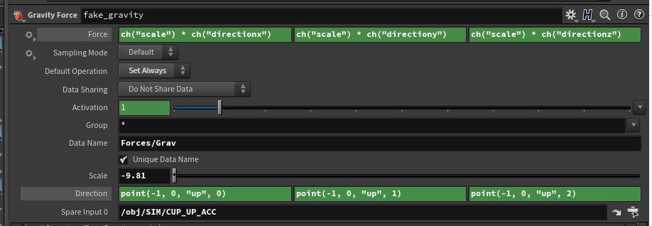
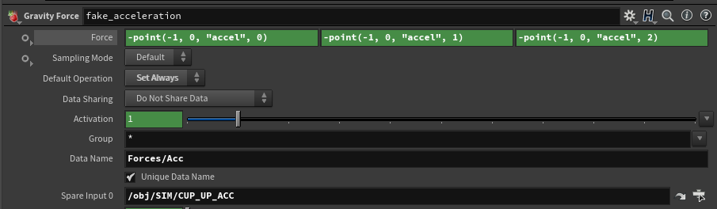

# CGWiki DLC
Various tips and tricks I learnt at UTS Animal Logic Academy and beyond. Hope someone finds this helpful!

## Smoke / Fluids: Fix moving colliders
Fluids often screw up whenever colliders move, for example water in a moving cup or smoke in an elevator. Either the collider deletes the volume as it moves, or velocity doesn't transfer from the collider.

A great fix comes from Raphael Gadot: stabilise the environment around the collider. This means the sim is done in local space with the collider fixed in place, then inverted back to world space. Raphael stresses this isn't a proper technique, but it works well in my tests.

For gravity:
1. Add `@orient` and `@up` vectors in world space (before Transform Pieces).
```js
v@up = {0, 1, 0};
p@orient = {0, 0, 0, 1};
```
2. Add a Gravity Force node to your sim (after Transform Pieces). Use the transformed `@up` vector as the gravity force.



```js
Force X = -9.81 * point(-1, 0, "up", 0)
Force Y = -9.81 * point(-1, 0, "up", 1)
Force Z = -9.81 * point(-1, 0, "up", 2)
```
Make sure the Gravity Force is set to "Calculate Always" since the gravity always changes.

For acceleration:
1. Add a Trail node set to "Calculate Velocity", then enable "Calculate Acceleration". It's faster to do this after packing so it only trails one point. Make sure to trail in the correct reference frame.

2. Add another Gravity Force node, using negative `@accel` as the force vector.



```js
Force X = -point(-1, 0, "accel", 0)
Force Y = -point(-1, 0, "accel", 1)
Force Z = -point(-1, 0, "accel", 2)
```
Make sure the Gravity Force is set to "Calculate Always", since the acceleration always changes.

For stabilisation:
1. Pick a face on the collider you want to stabilise. Blast everything except that face.
2. Use an Extract Transform node to find where it moves over time.
3. Pack everything else. Make sure to enable "No Point Velocities" in case it screws with our trail.
4. Plug the packed geometry into a Transform Pieces node, then plug the Extract Transform result into the other input.
5. It should be stabilized. Unpack and do your sim with the gravity forces described above.
6. Pack the simulation result.
7. Use a Transform Pieces node with the same Extract Transform input. This time, set it to "Invert Transform" to go back to world space.
8. Unpack the world space result.

This works best for enclosed containers. When fluid exits the container, you have to do a separate sim in the new reference frame. This is possible by killing points outside the container, then feeding the killed points into the other sim.

Another tip is using "Central Difference" when trailing. This gives the fluid more time to move away from the collider, and helps calculate motion blur.

## Cloth: Fix Preroll
Cloth sims work best with preroll starting in a neutral rest pose. For example, the character starts in an A-Pose or T-Pose before transitioning into the animation. 

If anim screwed you over, never fear! Preroll can be added in Houdini. 

1. Export the animated character as FBX, including the skeleton.
2. Import the character with the FBX Character Import node.
2. Use the Skeleton Blend node to blend from the rest skeleton to the animated skeleton. If the rest skeleton has a bad pose, adjust it with the Rig Pose node. Alternatively, export another FBX posed to your liking. FBX Character Import that animated skeleton as the rest skeleton.
3. Use the Time Shift node to move the animation forward so it doesn't bleed into the preroll. This can also be done in the "Timing" menu of FBX Character Import.
4. Use Bone Deform to animate the skin based on Skeleton Blend. 

## Cloth: Fix Rest Pose Clipping
Cloth sims screw up from clipping, especially when clipped from the start. One option is growing the character into the cloth. 

1. Disable gravity in the cloth sim.
2. Use Smooth, Peak or VDB Reshape to shrink the character.
3. Animate the character growing.
4. Enable gravity in the cloth sim.
5. Use the Time Shift node to move the animation forward so it doesn't bleed into the growing. 

## Cloth: Layer Stacking
One little known feature of Vellum Cloth (at least to me) is layering. It can improve the physics of overlapping garments, like jackets on top of t-shirts. 

1. In Vellum Configure Cloth, use the "Layer" setting to define the ordering, bottom to top.
2. On the Vellum Solver under "Collisions", enable "Layer Shock". Lower layers are simulated much heavier than higher layers. 

## Cloth: Fix Everything
With Vellum Cloth, if anything screws up it usually needs substeps. Bending and stretching settings have no effect? Increase the substeps! Collisions passing through? Increase the substeps! 

SideFX recommends at least 5 substeps as a starting point, with many more needed for most situations. Sotiris Bakosis said over 200 substeps were used for a balloon string shot in Peter Rabbit. 

To avoid infinite sim time, try using "Constraint Iterations" or "Collision Iterations" instead. Good info on this can be found in the Vellum Cloth masterclasses by Jeff Lait.

## Karma: Fix motion blur
Motion blur in Karma rarely works properly out of the box, even with manual velocity vectors.

A great fix comes from [CGWiki](https://www.tokeru.com/cgwiki/index.php?title=UsdGuide18): simply add a Cache node set to "Rolling Window". Usually I use 1 frame before and 1 frame after.

This works faster than Karma's motion blur LOP, which caches the entire timeline at once.

## Fluids: Fix density loss 
Don't take this section seriously. These are just techniques which seem to work for me. 

Density loss often happens when Surface Tension is enabled. Droplets tend to disappear when bunched too close together, so try disabling it before anything else. 

Grid Scale and Particle Radius Scale also affect the density. It seems to oversmooth sometimes, leading to particles being smoothed out of existence. 

According to [SideFX](https://www.sidefx.com/docs/houdini/nodes/dop/flipsolver.html), if the Particle Radius Scale divided by the Grid Scale is at least sqrt(3)/2, it will never be underresolved. 

In case this affects density, to find the minimum: 
```js
Particle Radius Scale = Grid Scale × (sqrt(3)/2)
Grid Scale = Particle Radius Scale / (sqrt(3)/2)
```
