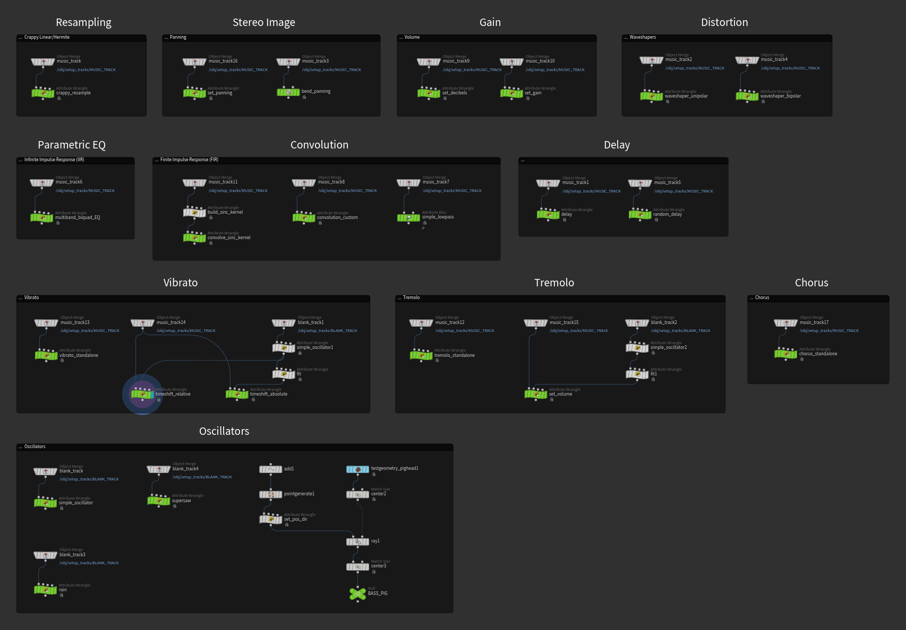
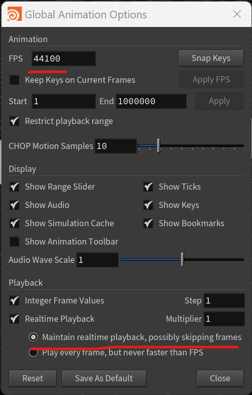

# Houdini Sound Effects

Houdini works fine for visual effects, but the real question is does it work for sound effects?

I recently lost my mind and made a bunch of audio effects and a couple of synths in Houdini. Why? No clue!

[Download the HIP file!](hips/sdfs/sdf_volumes.hipnc?raw=true)

Originally this worked using [a brute force tool I made](https://mysterypancake.github.io/Houdini-Fun/tools/RawAudio). You had to copy data from Houdini to hear it. This was slow and tedious, taking the fun away from sound design and experimentation.

Luckily CHOPS has direct audio output, which it uses now. It's much faster and lets you hear the result without leaving Houdini!

## Setup

First you need a huge framerate. While most cameras record at 24 FPS, most audio files are recorded at 44100 FPS or higher! That means the sample rate is 44100 Hz.

Why such a high sample rate? It sets the highest frequency you can store in a waveform, called the Nyquist frequency. Nyquist is half the sample rate, so the highest frequency for a 44100 Hz waveform is 22050 Hz. Humans can only hear up to about 20000 Hz, so this is a good number. You can go lower but it starts sounding muffled as the treble gets cut away.

Using a high framerate makes it terribly slow to simulate stuff. I tried plucking a string in Vellum and it took over 10 minutes to simulate without subframes! Until I get that working, all the audio effects are digital instead of analog :(

With such a high framerate, Houdini playback is always slow. This causes audio buffering.

**Make sure to select "Maintain realtime playback, possibly skipping frames". This stops most of the buffering issues!**
