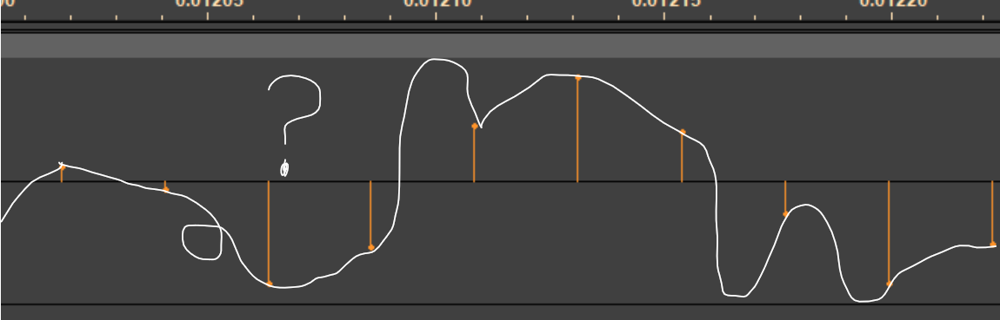

# Houdini Sound Effects

Houdini works fine for visual effects, but the real question is does it work for sound effects?

I recently lost my mind and made a bunch of audio effects and synths in Houdini. Why? No clue!

[Download the HIP file!](hips/sdfs/sdf_volumes.hipnc?raw=true)


Originally this worked using [a brute force website I made](https://mysterypancake.github.io/Houdini-Fun/tools/RawAudio). You had to copy data from Houdini onto the website to hear it. This was slow and tedious, taking the fun away from sound design and experimentation.

Luckily CHOPS has direct audio output, which I'm using now. It's much faster and lets you hear the result without leaving Houdini!

## Setup

This section explains how to setup CHOPS if you want to remake this yourself. Otherwise, feel free to jump ahead to the [nodes](#nodes) section!


First you need a huge framerate. While most cameras record at 24 FPS, most audio files are recorded at 44100 FPS or higher! That means the sample rate is 44100 Hz.

Why such a high sample rate? It sets the highest frequency you can store in a waveform, called the Nyquist frequency. Nyquist is half the sample rate, so the highest frequency for a 44100 Hz waveform is 22050 Hz. Humans can only hear up to about 20000 Hz, so this is a good number. You can go lower but it starts sounding muffled as the treble gets cut away.

Using a high framerate makes it terribly slow to simulate stuff. I tried plucking a string in Vellum and it took over 10 minutes to simulate without subframes! Until I get that working, all the audio effects are digital instead of analog :(

With such a high framerate, Houdini playback is always slow. This causes audio buffering.

**Make sure to select "Maintain realtime playback, possibly skipping frames". This stops most of the buffering issues!**

TODO: FINISH THIS SECTION

<br clear="left"/>

## Nodes

### Resampling

Resampling changes the pitch of audio by stretching and squashing it. Stretching makes the pitch lower, squashing makes the pitch higher.


Resampling is easy for integer speeds. Each point contains a sample, so multiply the point number and grab the result at the new index.

```c
// This only works for whole numbers
int speed = chi("speed");
vector newPos = point(0, "P", i@ptnum * speed);

// Modify Y (left) and Z (right) only
v@P.y = newPos.y;
v@P.z = newPos.z;
```

Doubling the speed makes everything raise by 1 octave (12 semitones). It also makes the speed twice as fast.

For fractional speeds it's a lot harder. Just like resizing an image, you have to interpolate between samples to fill in missing data.



There's many ways to interpolate signals, [hear them on my website!](https://mysterypancake.github.io/Houdini-Fun/tools/Resampling) Sinc is the highest possible quality for audio.

Sadly I haven't made sinc in Houdini yet, so you'll have to deal with crappy linear and hermite interpolation for now.

```c
vector interpolatePos(int mode; float index) {
    if (mode == 0) {
        // Linear interpolation, horrible quality
        vector prev = point(0, "P", floor(index));
        vector next = point(0, "P", int(ceil(index)));
        return lerp(prev, next, frac(index));
    } else {
        // Hermite interpolation, less horrible but not good
        // From https://www.musicdsp.org/en/latest/Other/93-hermite-interpollation.html
        int rounded = floor(index);
        float x = frac(index);
        vector y0 = point(0, "P", rounded - 1);
        vector y1 = point(0, "P", rounded);
        vector y2 = point(0, "P", rounded + 1);
        vector y3 = point(0, "P", rounded + 2);
        vector c1 = 0.5 * (y2 - y0);
        vector c3 = 1.5 * (y1 - y2) + 0.5 * (y3 - y0);
        vector c2 = y0 - y1 + c1 - c3;
        return ((c3 * x + c2) * x + c1) * x + y1;
    }
}

int mode = chi("interpolation");
float oldX = v@P.x;
v@P = interpolatePos(mode, float(i@ptnum) * chf("speed"));
v@P.x = oldX;
```

### Stereo Image

Stereo audio is beautiful, it has so much depth and impact compared to mono. Messing with the relationship between the left and right channels has a massive effect, so let's get into it!

#### Panning

Panning is great for separating elements in a mix, directly controlling the left/right balance. It's harder to make than you'd think, because music sounds quieter when only heard from one ear.

To compensate, most software like [FL Studio](https://www.image-line.com/fl-studio-learning/fl-studio-online-manual/html/songsettings_settings.htm) uses a circular panning law. It boosts everything up to 3 dB away from the center.


I've never done it before, so I stole an algorithm from the [Web Audio API](https://webaudio.github.io/web-audio-api/#stereopanner-algorithm). Thanks guys!

```c
// From https://webaudio.github.io/web-audio-api/#stereopanner-algorithm
float pan = clamp(chf("pan"), -1, 1);
float x = pan + (pan <= 0);
float gainL = cos(x * PI * 0.5);
float gainR = sin(x * PI * 0.5);

float inputL = v@P.y;
float inputR = v@P.z;
if (pan <= 0) {
    v@P.y = inputL + inputR * gainL;
    v@P.z = inputR * gainR;
} else {
    v@P.y = inputL * gainL;
    v@P.z = inputR + inputL * gainR;
}
```

#### Bend Panning
todo

### Gain
todo

### Distortion
todo

### Parametric EQ
todo

### Convolution
todo

### Delay
todo

### Vibrato
todo

### Tremolo
todo

### Chorus
todo

### Oscillators
todo
