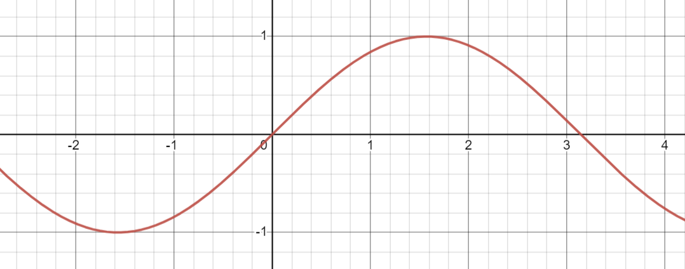

# Vexember 2023
Vexember is a Houdini challenge created by [Paul Esteves](https://www.youtube.com/watch?v=uxevpt_xK68) and some other legends on the CGWiki Discord.

It's covered tons of my favourite topics, so here's a writeup with some fun exercises along the way. Whether new or old to Houdini, I hope you learn something new!

## Day 1: SDFs


The first challenge uses Signed Distance Functions (SDFs). So what the hell is an SDF? Great question!

Traditionally, geometry is made up of thousands of little triangles. Triangles are great for sharp pointy objects like pyramids, but if you want a nice smooth object like a sphere, you're out of luck. You'll need infinite triangles to perfectly represent a sphere.


If only there was a better way. Turns out there is! With SDFs, you get a [perfect circle out of the box](https://www.shadertoy.com/view/3ltSW2).

How is this possible? Simple! We don't use triangles. Instead we use distances, more specifically the distance from us to the object.


Let's start by making our first SDF, the SDF of a point.

### SDF of a point

Drop down a grid in Houdini, and set the rows and columns to a large number. Next add a point wrangle. We want to find the distance from our current position to another point. Let's use the world origin `{0, 0, 0}`:

```c
v@Cd = distance(v@P, {0, 0, 0});
```

And just like that, we have a blurry circle:


Congratulations, we made our first SDF! Wasn't too hard, was it? The black part is where the distance is 0, and it gets brighter as the distance grows. It's only 2 lines of VEX, but let's see if we can make it even shorter.

Most SDFs you'll find online [like the classics by Inigo Quilez](https://iquilezles.org/articles/distfunctions2d/) don't use `distance()`. Instead they use `length()`.

`length()` gets the magnitude of a vector, meaning how far it is from `{0, 0, 0}`. That's exactly what we're doing:

```c
// Using length()
v@Cd = length(v@P);

// Using distance()
v@Cd = distance(v@P, {0, 0, 0});
```

Much shorter! But what if we want to move our point to a different location? Turns out `length()` works for that too!

```c
// Move 1 unit along the X axis
vector p2 = {1, 0, 0};

// Using length()
v@Cd = length(v@P - p2);

// Using distance()
v@Cd = distance(v@P, p2);
```

You can think of this as centering the geometry before measuring, or moving the camera versus moving the object.

Now let's make our second SDF, the SDF of a circle.

### SDF of a circle
Let's start from the SDF of a point.

```c
v@Cd = length(v@P);
```

We know the distance grows in a circular fashion away from `{0, 0, 0}` so let's shade the area above a certain radius:

```c
// Shade everything below 1 black and above 1 white
float radius = 1;
v@Cd = length(v@P) > radius;
```


Congratulations - no, wait a minute, this isn't a SDF! We forgot the 'S'!

The 'Signed' in 'Signed Distance Function' means the distance is negative on the inside and positive on the outside.


We need the inside to be negative. To do this, we simply subtract the radius:

```c
// Make the inside negative
float radius = 1;
v@Cd = length(v@P) - radius;
```


Congratulations, we made our second SDF! You're practically a geometry god already.

Though I must say, your artistic ability is falling a little. These blurry shapes look pretty boring. Let's enter the world of waveforms!

### Waveforms
[Pick a shape, any shape](https://thebookofshaders.com/05/)! Let's try a sine wave.

Take the point SDF and plug it into `sin()`:

```c
// SDF of a point located at {0, 0, 0}
float sdf = length(v@P);

// Make a sine wave from the SDF
v@Cd = sin(sdf * 10);
```


Very trippy! Seems a bit dark though? This is because we're writing to `@Cd` which is 0 to 1, but sine is -1 to 1.



We can fix this by adjusting sine's range, either manually or with `fit11()`.

```c
float sdf = length(v@P);
float wave = sin(sdf * 10);

// Manually
v@Cd = wave * 0.5 + 0.5;

// With fit11()
v@Cd = fit11(wave, 0, 1);
```


Much nicer! Now let's add some movement to make it more interesting. We can do this by changing the phase based on time:

```c
float sdf = length(v@P);

// Make the sine wave move based on time
float frequency = 10;
float phase = @Time * -10;
float wave = sin(sdf * frequency + phase);

v@Cd = fit11(wave, 0, 1);
```


Looking good! Now I'll admit, I had to modify the code to get a seamless loop.

Sine waves are awkward to work with since their range is 0 to `2*PI`:


For a seamless loop, we need to remap from 0 to `2*PI` to 0 to 1:

```c
float sdf = length(v@P);

// Multiply by 2 * PI to get a seamless loop every second
float TAU = 2 * PI;
float frequency = 2 * TAU;
float phase = @Time * -TAU;
float wave = sin(sdf * frequency + phase);

v@Cd = fit11(wave, 0, 1);
```

With all that out of the way, let's start the actual challenge!

### The actual challenge

```c
// Get the position of the other point (wrangle input 1).
vector p2 = point(1, "P", 0);

// Get the distance from us to the other point. This is the signed distance function of a point.
float sdf = length(v@P - p2);

// We can visualise the SDFs using a sine wave. This is commonly found on ShaderToy
float frequency = 50; // Distance between peaks in the wave
float phase = @Time * -10; // How fast it wobbles over time
float wave = sin(sdf * frequency + phase);

// Sine waves range from -1 to 1, so remap it to 0 to 1 since RGB is 0 to 1
wave = fit11(wave, 0, 1); // Or wave * 0.5 + 0.5

v@Cd = wave; // Color based on the wave
v@P += v@N * wave * 0.02; // Peak based on the wave. 0.02 is the distance to peak
```
