# Vexember 2023
Vexember is a Houdini challenge created by [Paul Esteves](https://www.youtube.com/watch?v=uxevpt_xK68) and some other legends on the CGWiki Discord.

It's covered tons of my favourite topics, so here's a writeup with some fun exercises along the way. Whether new or old to Houdini, I hope you learn something new!

## Day 1: SDFs
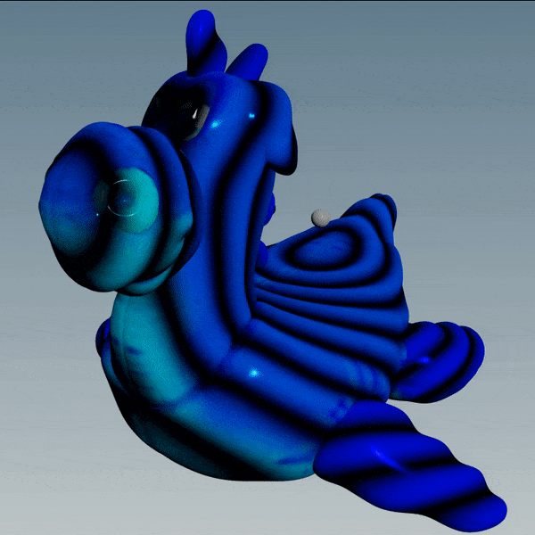

The first challenge uses Signed Distance Functions (SDFs). So what the hell is an SDF? Great question!

Traditionally, geometry is made up of thousands of little triangles. Triangles are great for sharp pointy objects like pyramids, but if you want a nice smooth object like a sphere, you're out of luck. You'll need infinite triangles to perfectly represent a sphere.

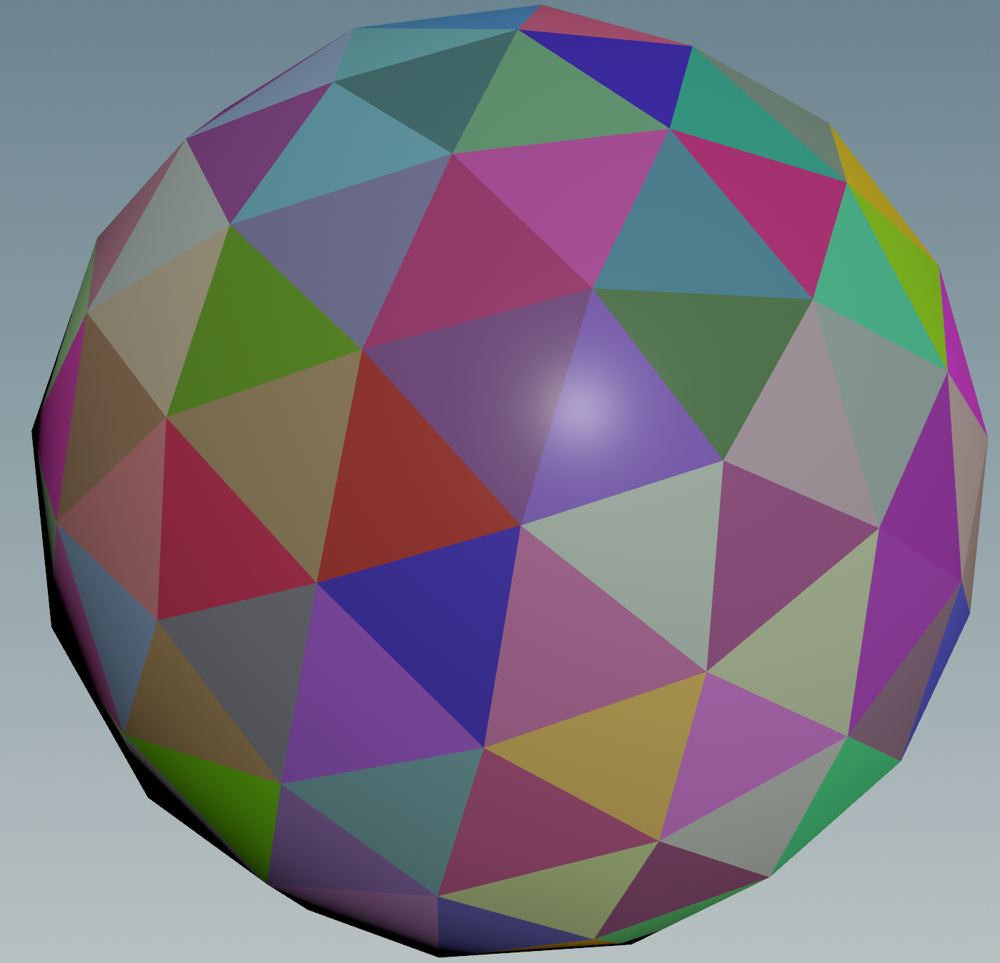

If only there was a better way. Turns out there is! With SDFs, you get a [perfect circle out of the box](https://www.shadertoy.com/view/3ltSW2).

How is this possible? Simple! We don't use triangles. Instead we use distances, more precisely the distance from us to the nearest object.

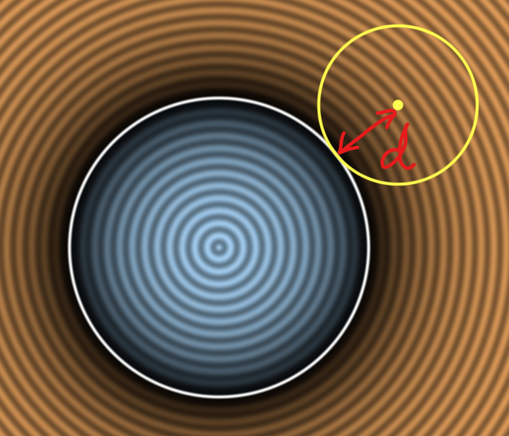

I can't mention SDFs without mentioning [ShaderToy](https://www.shadertoy.com/). It's the coolest website on the internet, and a god tier resource for SDFs along with raymarching, noises, shapes and every topic under the sun. Be sure to check it out, and try out shader programming!

Let's start by making our first SDF, the SDF of a point.

### SDF of a point

Drop down a grid in Houdini, and set the rows and columns to a large number. Next add a Point Wrangle. We want to find the distance from our current position to another point. Let's use the world origin `{0, 0, 0}`:

```js
v@Cd = distance(v@P, {0, 0, 0});
```

And just like that, we have a blurry circle:

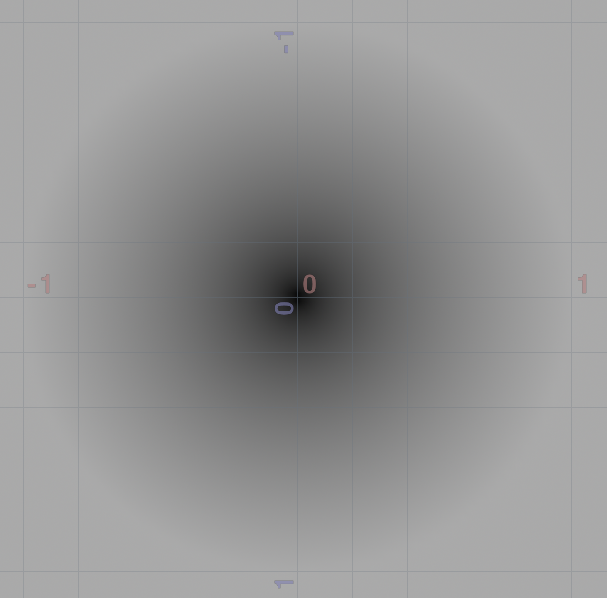

Congratulations, we made our first SDF! Wasn't too hard, was it? The black part is where the distance is 0, and it gets brighter as the distance grows. It's only 2 lines of VEX, but let's see if we can make it even shorter.

Most SDFs you'll find online [like these classics by Inigo Quilez](https://iquilezles.org/articles/distfunctions2d/) don't use `distance()`. Instead they use `length()`.

`length()` gets the magnitude of a vector, meaning how far it is from `{0, 0, 0}`. That's exactly what we're doing:

```js
// Using length()
v@Cd = length(v@P);

// Using distance()
v@Cd = distance(v@P, {0, 0, 0});
```

Much shorter! But what if we want to move our point to a different location? Turns out `length()` works for that too!

```js
// Move 1 unit along the X axis
vector p2 = {1, 0, 0};

// Using length()
v@Cd = length(v@P - p2);

// Using distance()
v@Cd = distance(v@P, p2);
```

You can think of this as centering the geometry before measuring, or moving the camera versus moving the object.

Now let's make our second SDF, the SDF of a circle.

### SDF of a circle
Let's start from the SDF of a point.

```js
v@Cd = length(v@P);
```

We know the distance grows in a circular fashion away from the center, so let's color everything above a certain distance:

```js
// Shade everything below 1 black and above 1 white
float radius = 1;
v@Cd = length(v@P) > radius;
```

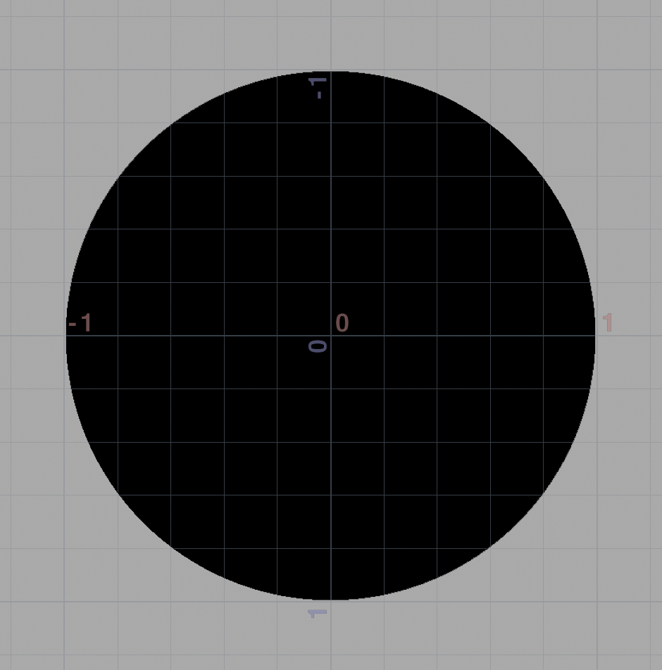

Congratulations - no, wait a minute, this isn't a SDF! We forgot the 'S'!

The 'Signed' in 'Signed Distance Function' means the distance is negative on the inside and positive on the outside.

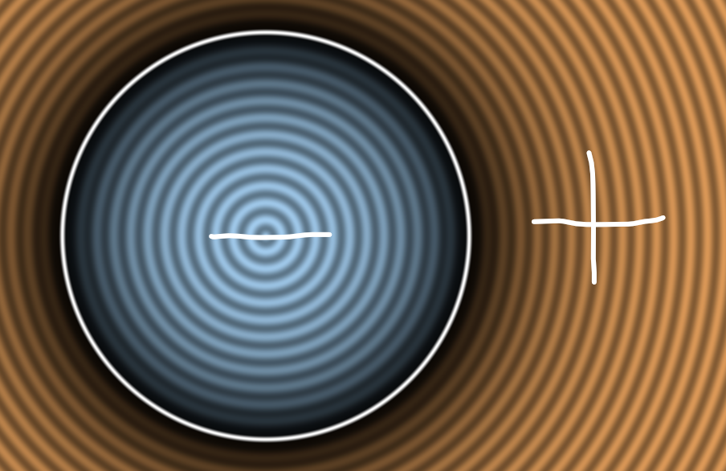

We need the inside to be negative. It's easy to achieve, just subtract the radius:

```js
// Make the inside negative
float radius = 1;
v@Cd = length(v@P) - radius;
```

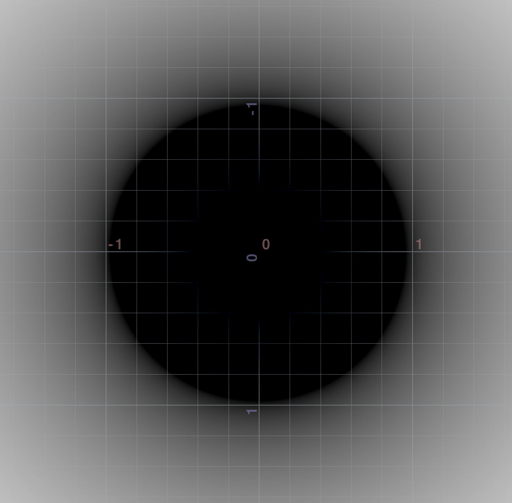

Now we can use the same method as before to sharpen the edge:

```js
float radius = 1;
float sdf = length(v@P) - radius;

// Shade positive white and negative black
v@Cd = sdf > 0;
```


Congratulations, we made our second SDF! You're practically a geometry god already.

Though I must say, your artistic ability is falling a little. These blurry shapes look pretty boring. Let's enter the world of waveforms!

### Waveforms
[Pick a wave, any wave](./Waveforms.md)! Let's try a sine wave.

Take the point SDF and plug it into `sin()`:

```js
// SDF of a point located at {0, 0, 0}
float sdf = length(v@P);

// Make a sine wave from the SDF
v@Cd = sin(sdf * 10);
```

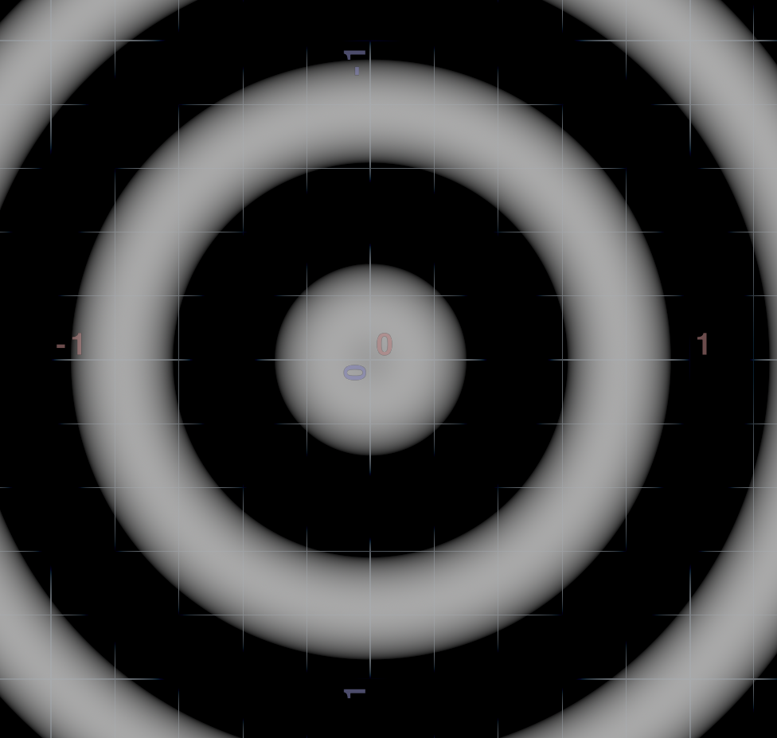

Very trippy! Seems a bit dark though? It's because we're writing to `@Cd` which usually ranges from 0 to 1, but sine waves range from -1 to 1.

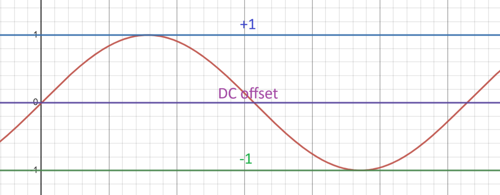

We can fix it by remapping the range to 0 to 1, either manually or with `fit11()`.

```js
float sdf = length(v@P);
float wave = sin(sdf * 10);

// Manually
v@Cd = wave * 0.5 + 0.5;

// With fit11()
v@Cd = fit11(wave, 0, 1);
```

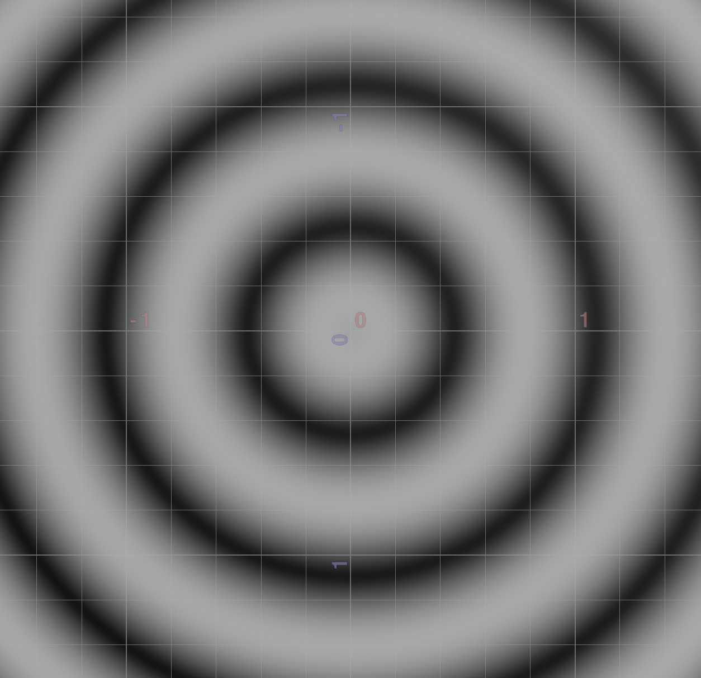

Much nicer! Now let's add some movement to make it more interesting. To do this, we need to know how sine waves work.

I split this part into a [separate article](./Waveforms.md). I suggest reading it and coming back when you're done!

Once you're back, you should have a better idea of how to add the movement. We can modify the **phase**:

```js
float sdf = length(v@P);

// Make the sine wave move based on time
float frequency = 10;
float phase = @Time * -10;
float wave = sin(sdf * frequency + phase);

v@Cd = fit11(wave, 0, 1);
```

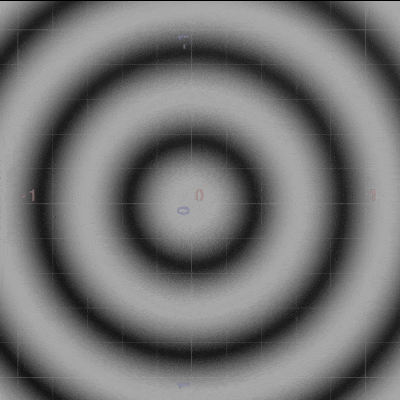

Looking good! Now I'll admit, I had to modify the code to get a seamless loop.

Sine waves are awkward to work with since they repeat every 2*PI units:

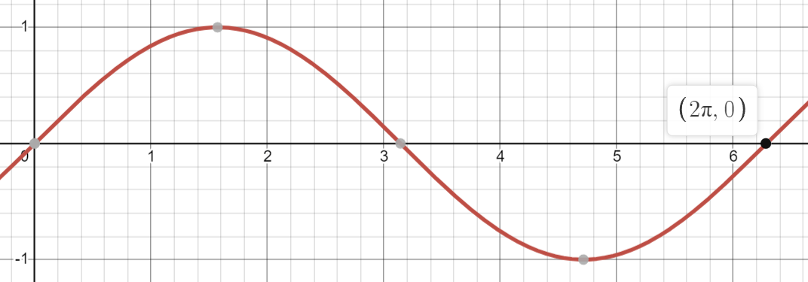

For a seamless loop, we need to remap from 0 to 2*PI to 0 to 1. This can be done with multiplication:

```js
float sdf = length(v@P);

// Multiply by 2 * PI to get a seamless loop every second
float TAU = 2 * PI;
float frequency = 2 * TAU;
float phase = @Time * -TAU;
float wave = sin(sdf * frequency + phase);

v@Cd = fit11(wave, 0, 1);
```

With all that out of the way, let's start the actual challenge!

### The actual challenge
Add a toy and a point. Plug them into a Point Wrangle.

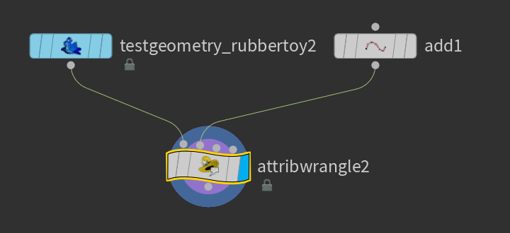

First let's color the toy based on the distance to the point like before:

```js
// Get the position of the other point (wrangle input 1)
vector p2 = point(1, "P", 0);

// Color the distance from us to the point
float sdf = length(v@P - p2);
v@Cd = sdf;
```

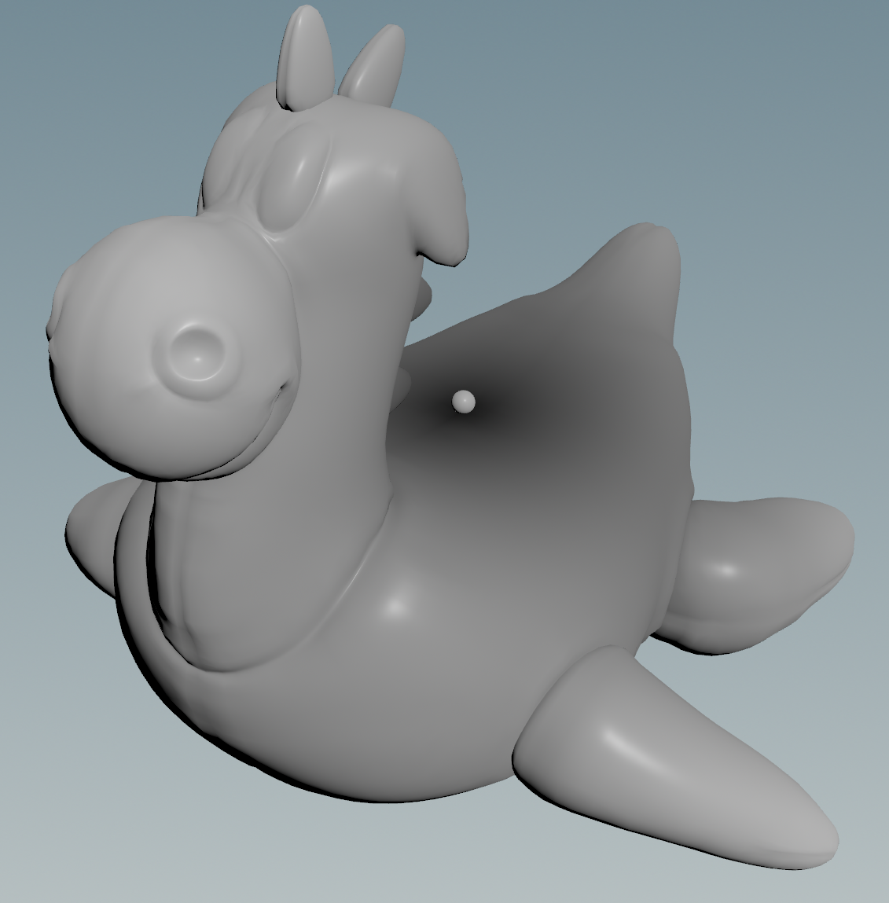

Looking good! Now let's add a sine wave:

```js
// Get the position of the other point (wrangle input 1)
vector p2 = point(1, "P", 0);

// Plug the SDF into a sine wave
float sdf = length(v@P - p2);
float wave = sin(sdf * 30);

// Remap sine -1 to 1 to RGB 0 to 1
v@Cd = fit11(wave, 0, 1);
```

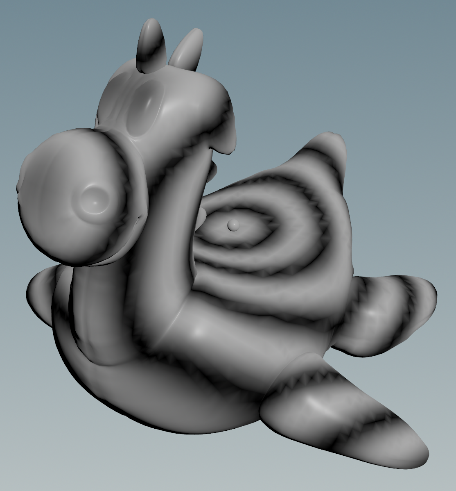

Trippy! Now let's make the sine wave move over time:

```js
// Get the position of the other point (wrangle input 1)
vector p2 = point(1, "P", 0);

// Change the sine wave's phase over time
float sdf = length(v@P - p2);
float frequency = 30;
float phase = @Time * -5;
float wave = sin(sdf * frequency + phase);

// Remap sine -1 to 1 to RGB 0 to 1
v@Cd = fit11(wave, 0, 1);
```

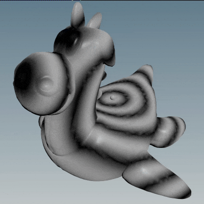

Finally let's scale the geometry based on the sine wave. We can do this by adding the normal to the position, much like the Peak node:

```js
// Get the position of the other point (wrangle input 1)
vector p2 = point(1, "P", 0);

// Change the sine wave's phase over time
float sdf = length(v@P - p2);
float frequency = 30;
float phase = @Time * -5;
float wave = sin(sdf * frequency + phase);

// Remap sine -1 to 1 to RGB 0 to 1
v@Cd = fit11(wave, 0, 1);

// Offset geometry based on normal, 0.02 controls depth
v@P += v@N * wave * 0.02;
```


Congratulations, you made it through day 1! Now it's your turn to add subdivision, color and animate the point.

Be sure to check out [ShaderToy](https://www.shadertoy.com/), [The Book of Shaders](https://thebookofshaders.com/) and [Inigo Quilez](https://iquilezles.org/articles/distfunctions/) for more!

### Advanced
If SDFs are old news to you, here's something new! So far we've drawn SDFs with colors, but what if we want to turn them into actual geometry? Turns out we can using VDB Level Sets!

Add a VDB node. Set it to make a 'Level Set' named 'surface'.

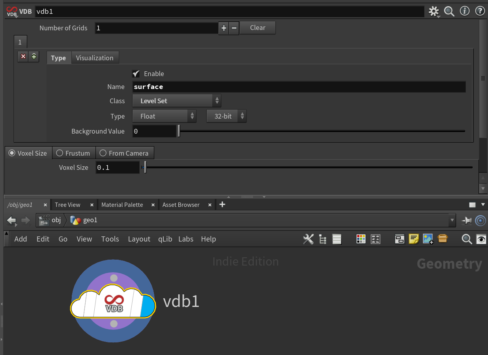

Add a VDB Activate node. Set the size of your volume to (2, 2, 2).

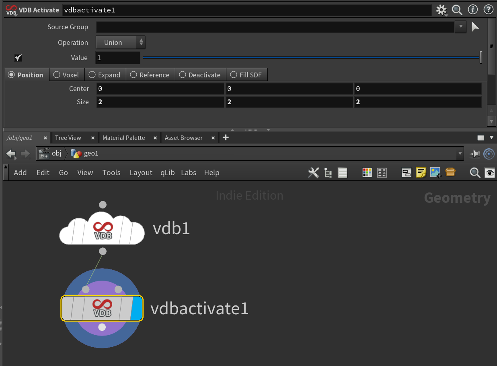

Add a Volume Wrangle. Here you can type in your SDF, for example let's use the sphere we made earlier:

```js
// SDF of a sphere
float radius = 1;
f@surface = length(v@P) - radius;
```

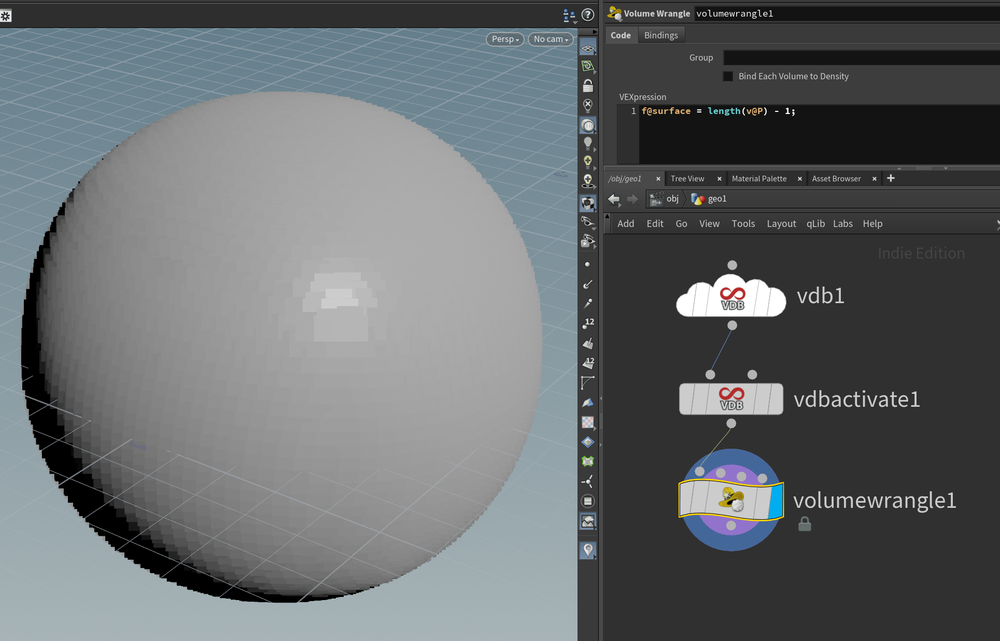

Finally, add a VDB Convert node to turn it from a volume into polygons.

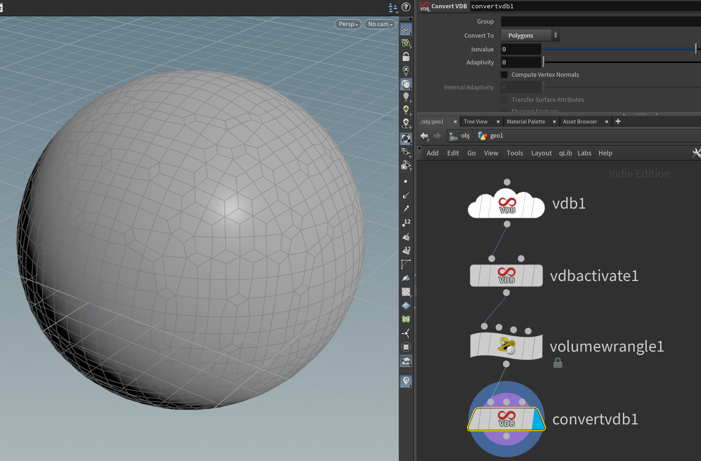

I did this for every SDF I could find. [You can find them all here!](./Houdini_SDFs.md)


## Day 2: Voronoi
TODO (mention circular scatter and generalised SDF formula)

## Day 3: Lerp and easings
TODO

## Day 4: Linked lists and sorting
TODO

## Day 5: Braids and coils
TODO

## Day 6: Quantizing
TODO (mention custom scatter + fuse)

## Day 7: Matrices and HSV
TODO

## Day 8: Noise octaves
TODO

## Day 9: Quaternions
TODO

## Day 10: Insets
TODO

## Day 11: Rolling
TODO

## Day 12
TODO

## Day 13
TODO

## Day 14: Matrices again
TODO

## Day 15: Ray and intersect
TODO

## Day 16: Coils again
TODO

## Day 17
TODO (mention https://www.tokeru.com/cgwiki/HoudiniDops.html#pops_and_grid_noise)

## Day 18: Lerp along edges
TODO

## Day 19: NDC coordinates
TODO

## Day 20: Lerp sequences
TODO

## Day 21
TODO

## Day 22: Curl noise and trails
TODO

## Day 23: Arctan and spirals
TODO

## Day 24
TODO
