# Houdini Waveforms
Waveforms are really useful [shaping functions](https://thebookofshaders.com/05/). They can be used for ripples, oscillations, and of course [Vexember challenges](./Vexember.md).

[](./Vexember.md)

Here's some basic information on waveforms, plus some common waveforms you might find useful.

## How waveforms work
Waveforms have 3 main parameters we can mess with: the [amplitude](https://en.wikipedia.org/wiki/Amplitude), [frequency](https://en.wikipedia.org/wiki/Frequency) and [phase](https://en.wikipedia.org/wiki/Phase_(waves)).

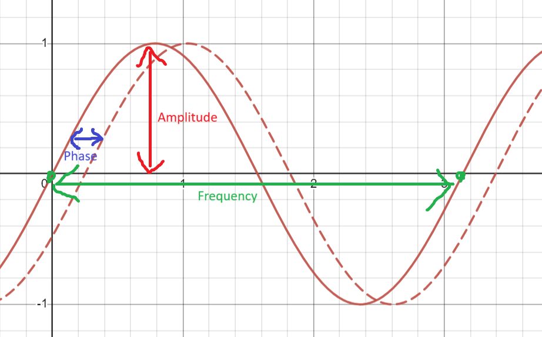

### Amplitude
[Amplitude](https://en.wikipedia.org/wiki/Amplitude) is the height of the wave. It controls the **volume** if the sound is heard.

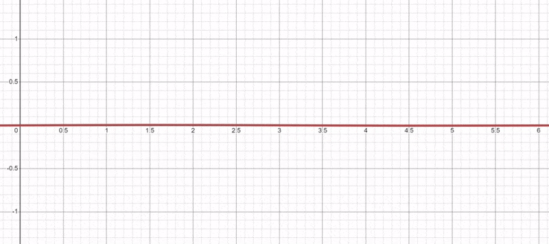

An amplitude of 0 means you can't hear the sound at all, while 1 means it plays at full blast.

When the amplitude is 1, the range of the wave is usually -1 to 1, centered at 0. The center is called the **DC offset**.

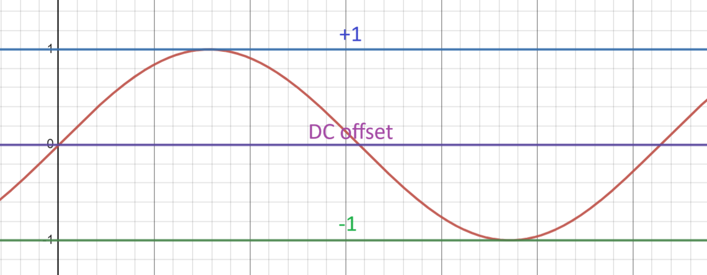

You control the amplitude by multiplying the wave:

```js
float wave = sin(time) * amplitude;
```

### Frequency
[Frequency](https://en.wikipedia.org/wiki/Frequency) is how often the wave repeats. It controls the **pitch** if the sound is heard.

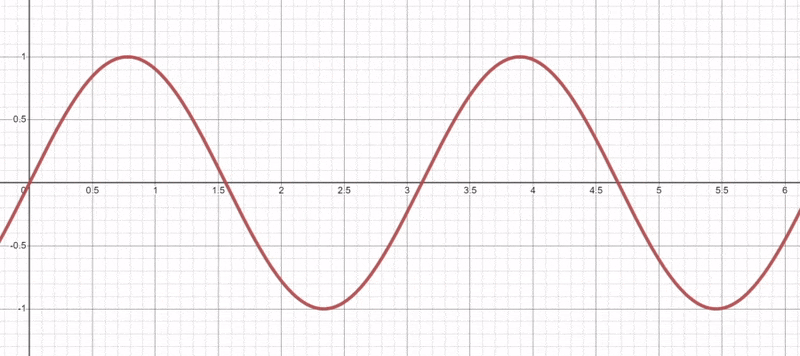

Each repeat is called a **cycle**. Sine and cosine waves complete a full **cycle** every `2*PI` radians (360 degrees).

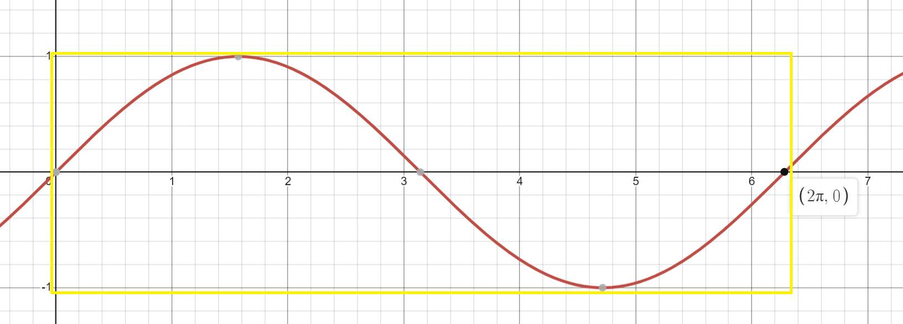

You control the frequency by multiplying the time:

```js
float wave = sin(time * frequency);
```

Since it's easier to use normalized units (0 to 1) than radians (0 to `2*PI`), multiply by `2*PI` to repeat every unit instead:

```js
float wave = sin(time * frequency * 2 * PI);
```

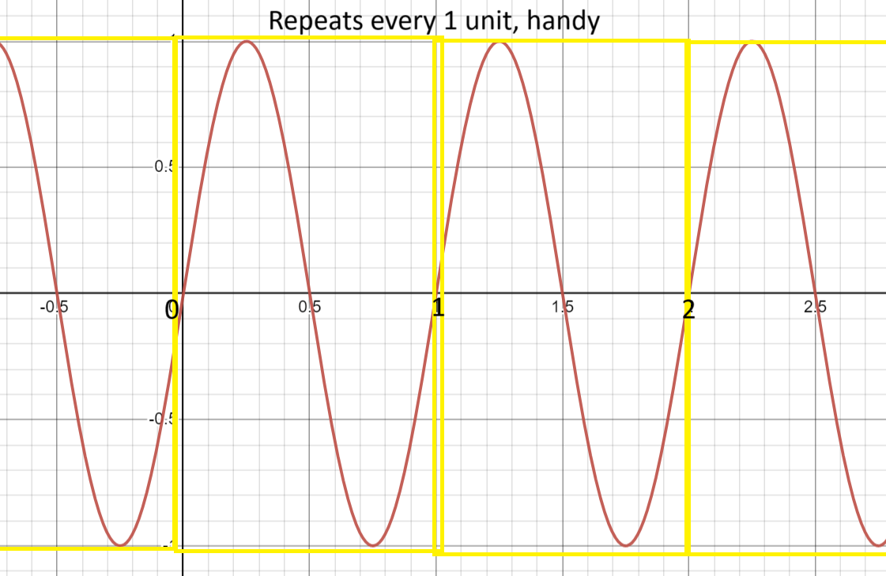

### Phase
[Phase](https://en.wikipedia.org/wiki/Phase_(waves)) is how far along we are in the wave's cycle. Visually it looks like a **time offset**.

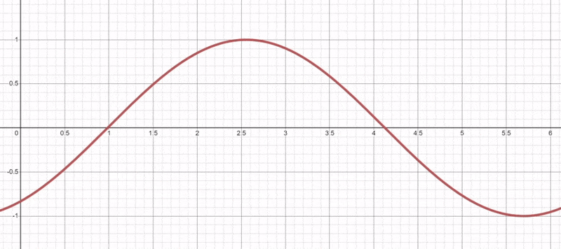

Conceptually it's more like a **rotation**.

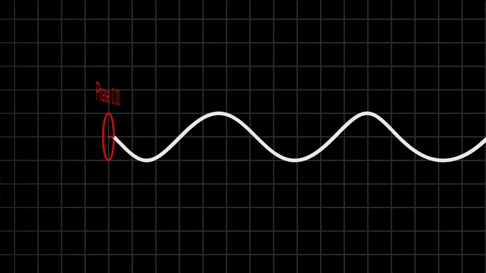

You control the phase by adding to the time:

```js
float wave = sin(time + phase);
```

### Amplitude, frequency and phase
Putting it all together, you can use the following formula to control **amplitude**, **frequency** and **phase**:

```js
float wave = amplitude * sin(time * frequency + phase);
```

### Sine vs cosine
Sine and cosine are identical, except for a **phase difference** of `PI/2`.

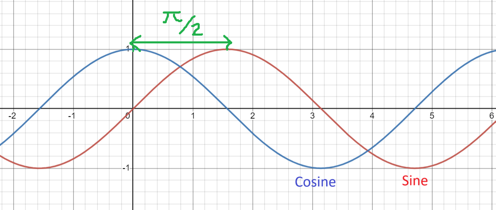

You can swap sine and cos by changing the **phase**:

```js
float cos = sin(time + PI / 2);
float sin = cos(time - PI / 2);
```

## Common waveforms
Here's a bunch of common waveforms. I originally made them for music on [ShaderToy](https://www.shadertoy.com/view/clXSR7), but they're great for Houdini too.

[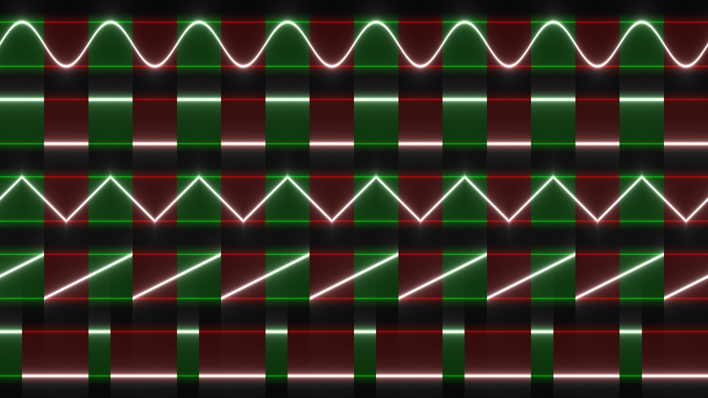](https://www.shadertoy.com/view/clXSR7)

- Each waveform is **phase aligned**, meaning the positive and negative **cycles** match. This prevents [interference](https://en.wikipedia.org/wiki/Wave_interference) when they're added together.
- Each waveform is centered with a **DC offset** of 0.
- Each waveform has an **amplitude** of 1, with each [sample](https://en.wikipedia.org/wiki/Sampling_(signal_processing)) ranging from -1 to 1. Multiply to control the volume.
- Each waveform's **phase** is controlled by adding to the time.

To use one, copy paste it into a wrangle and call it like so:

```js
float waveSine(float freq; float time) {
	return sin(2 * PI * freq * time);
}

// Sine wave which repeats every second
v@P.x += waveSine(1, f@Time);
```

## Sine wave
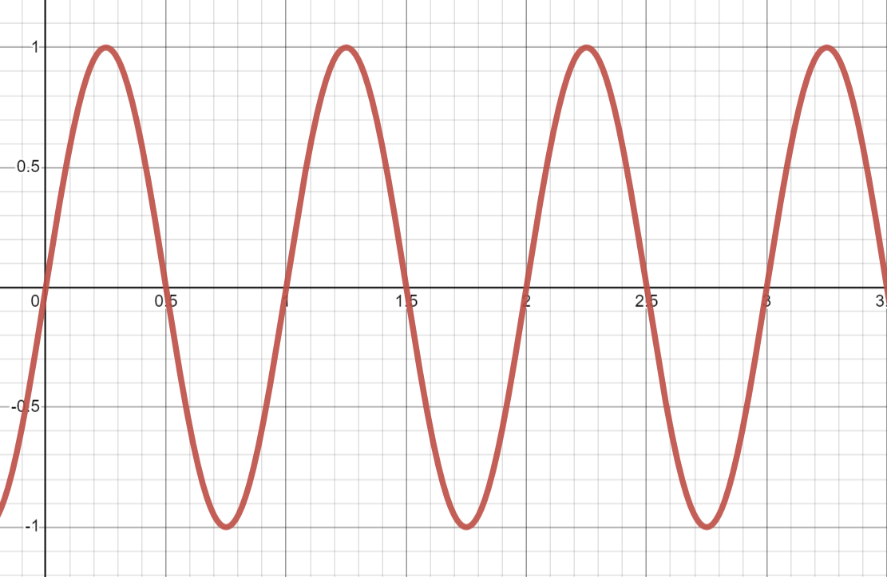

```js
float waveSine(float freq; float time) {
	return sin(2 * PI * freq * time);
}
```

Add 0.25 to `time` to get a cosine wave.

<br clear="right"/>

## Cosine wave
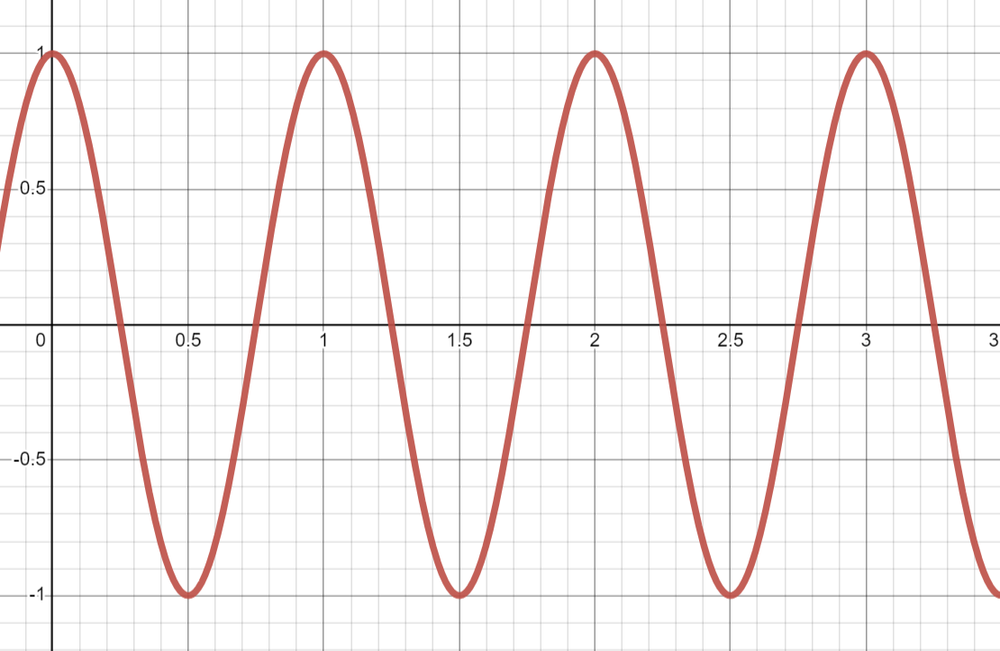

```js
float waveCosine(float freq; float time) {
	return cos(2 * PI * freq * time);
}
```

Subtract 0.25 from `time` to get a sine wave.

<br clear="right"/>

## Square wave
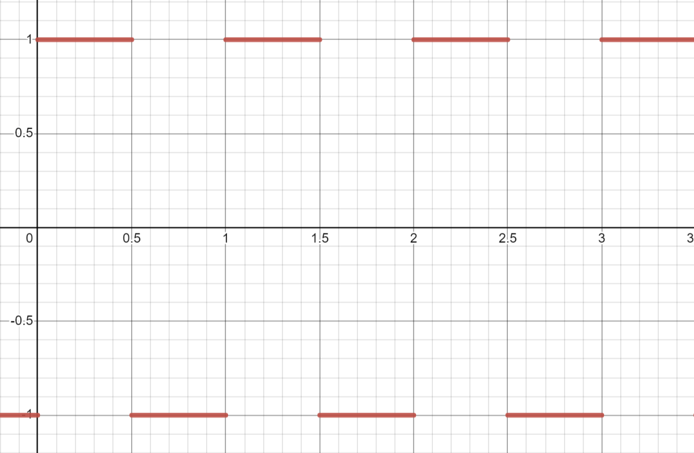

```js
float waveSquare(float freq; float time) {
	return ceil(0.5 - frac(freq * time)) * 2.0 - 1.0;
}
```

I used `ceil()` since it seems error prone than `sign()`.

<br clear="right"/>

## Triangle wave
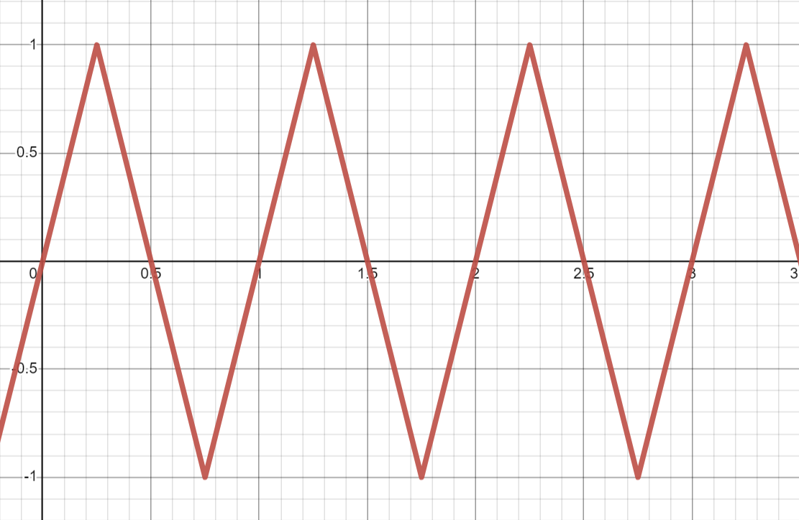

```js
float waveTriangle(float freq; float time) {
	return abs(frac(freq * time - 0.25) - 0.5) * 4.0 - 1.0;
}
```

I used `frac()` since it's faster than modulo.

<br clear="right"/>

## Sawtooth wave
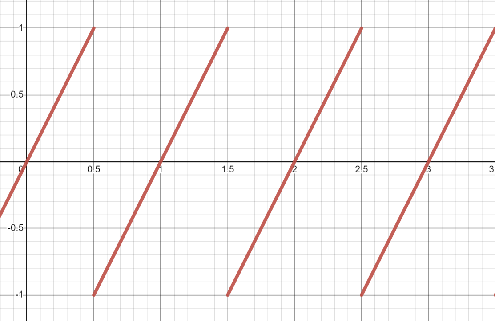

```js
float waveSaw(float freq; float time) {
	return frac(freq * time + 0.5) * 2.0 - 1.0;
}
```

<br clear="right"/>

## Pulse wave
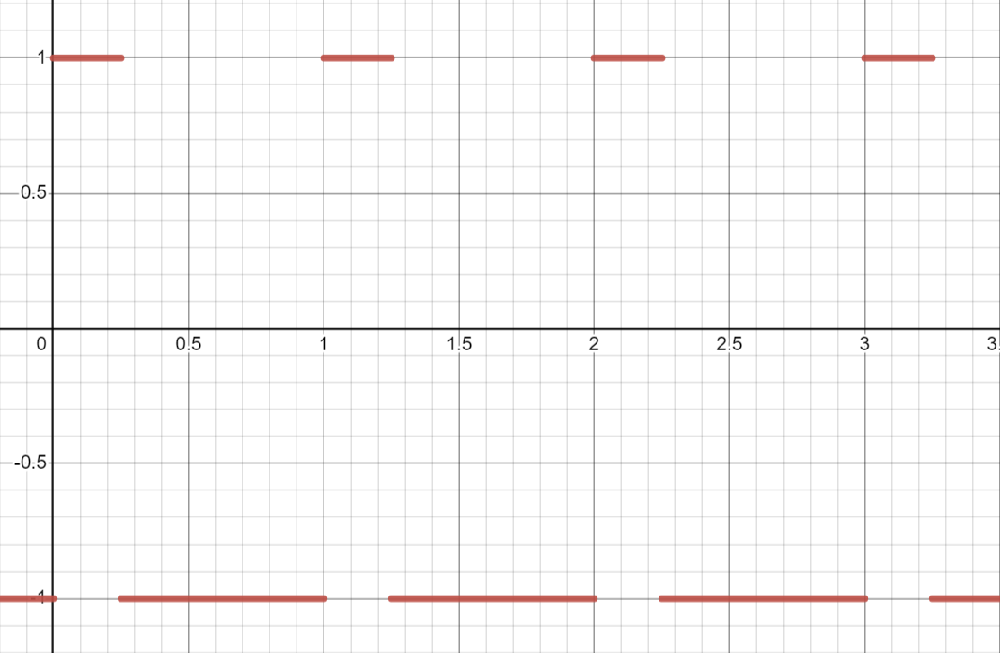

```js
float wavePulse(float freq; float time; float duty) {
	return (frac(freq * time) < duty) * 2.0 - 1.0;
}
```

`duty` controls how much of the wave is positive. It should be between 0 and 1.

Set `duty` to 0.5 to get a square wave.

<br clear="right"/>
