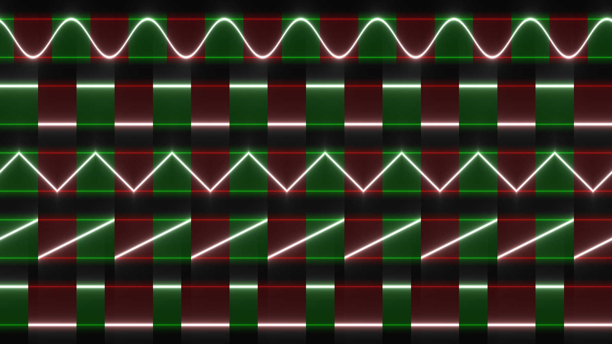

# Houdini Waveforms
I made these waveforms on [ShaderToy](https://www.shadertoy.com/view/clXSR7) for music production, but they're pretty useful in Houdini as well.

- Each are phase aligned with matching positive and negative cycles, so they won't interfere when added.
- Each are centered with a DC offset of 0.
- Each have samples are between -1 and 1 (maximum volume). Multiply to reduce the volume.
- Each can be adjusted in phase by adding to the time.



## Sine Wave
Add 0.25 to time to get a cosine wave.

```js
float waveSine(float freq; float time) {
	return sin(2 * PI * freq * time);
}
```

## Cosine Wave
Subtract 0.25 from time to get a sine wave.

```js
float waveCosine(float freq; float time) {
	return cos(2 * PI * freq * time);
}
```

## Square Wave

```js
float waveSquare(float freq; float time) {
	return ceil(0.5 - fract(freq * time)) * 2.0 - 1.0;
}
```

## Triangle Wave

```js
float waveTriangle(float freq; float time) {
	return abs(fract(freq * time - 0.25) - 0.5) * 4.0 - 1.0;
}
```

## Sawtooth Wave

```js
float waveSaw(float freq; float time) {
	return fract(freq * time + 0.5) * 2.0 - 1.0;
}
```

## Pulse Wave
Duty cycle is between 0 and 1.

```js
float wavePulse(float freq; float time; float duty) {
	return step(fract(freq * time), duty) * 2.0 - 1.0;
}
```
