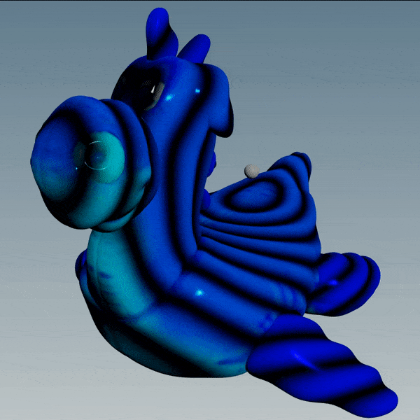

# Houdini Waveforms
Waveforms are really useful [shaping functions](https://thebookofshaders.com/05/). They can be used for ripples, oscillations, and of course [Vexember challenges](./Vexember.md).

[](./Vexember.md)

Here's some basic information on waveforms, plus some common waveforms you might find useful.

## How waveforms work
Waveforms have 3 main parameters we can mess with: the [amplitude](https://en.wikipedia.org/wiki/Amplitude), [frequency](https://en.wikipedia.org/wiki/Frequency) and [phase](https://en.wikipedia.org/wiki/Phase_(waves)).


### Amplitude
[Amplitude](https://en.wikipedia.org/wiki/Amplitude) is the height of the wave. It controls the **volume** if the sound is heard.

An amplitude of 0 means you can't hear the sound at all, while 1 means it plays at full blast.

When the amplitude is 1, the range of the wave is usually -1 to 1, centered at 0. The center is called the **DC offset**.


You control the amplitude by multiplying the wave:

```js
float wave = sin(time) * amplitude;
```

### Frequency
[Frequency](https://en.wikipedia.org/wiki/Frequency) is how often the wave repeats. It controls the **pitch** if the sound is heard.

Each repeat is called a **cycle**. Sine and cosine waves complete a full **cycle** every `2*PI` radians (360 degrees):


You control the frequency by multiplying the time:

```js
float wave = sin(time * frequency);
```

Since it's easier to use normalized units (0 to 1) than radians (0 to `2*PI`), you can multiply by `2*PI` to make it repeat every unit:

```js
float wave = sin(time * frequency * 2 * PI);
```


### Phase
[Phase](https://en.wikipedia.org/wiki/Phase_(waves)) is how far along we are in the wave's cycle. It controls the **time offset** if the sound is heard.

You control the phase by adding to the time:

```js
float wave = sin(time + phase);
```

### Amplitude, frequency and phase
Putting it all together, you can use the following formula to control **amplitude**, **frequency** and **phase**:

```js
float wave = amplitude * sin(time * frequency + phase);
```

Or this formula if you want to avoid working in radians (0 to `2*PI`):

```js
float wave = amplitude * sin(time * frequency * 2 * PI + phase);
```

## Common waveforms
Here's a collection of common waveforms. I originally made these on [ShaderToy](https://www.shadertoy.com/view/clXSR7) for music production, but they're useful in Houdini too.

- Each waveform is phase aligned, meaning the positive and negative cycles match. This prevents [interference](https://en.wikipedia.org/wiki/Wave_interference) when they're added together.
- Each waveform is centered with a DC offset of 0.
- Each have samples are between -1 and 1 (maximum volume). Multiply to reduce the volume.
- Each can be adjusted in phase by adding to the time.

[](https://www.shadertoy.com/view/clXSR7)

## Sine wave
Add 0.25 to time to get a cosine wave.

```js
float waveSine(float freq; float time) {
	return sin(2 * PI * freq * time);
}
```

## Cosine wave
Subtract 0.25 from time to get a sine wave.

```js
float waveCosine(float freq; float time) {
	return cos(2 * PI * freq * time);
}
```

## Square wave

```js
float waveSquare(float freq; float time) {
	return ceil(0.5 - fract(freq * time)) * 2.0 - 1.0;
}
```

## Triangle wave

```js
float waveTriangle(float freq; float time) {
	return abs(fract(freq * time - 0.25) - 0.5) * 4.0 - 1.0;
}
```

## Sawtooth wave

```js
float waveSaw(float freq; float time) {
	return fract(freq * time + 0.5) * 2.0 - 1.0;
}
```

## Pulse wave
Duty cycle is between 0 and 1.

```js
float wavePulse(float freq; float time; float duty) {
	return step(fract(freq * time), duty) * 2.0 - 1.0;
}
```
